# <span id="page-0-0"></span>**Evolution Strategies at the Hyperscale**

Bidipta Sarkar\*<sup>1,2</sup>, Mattie Fellows\*<sup>1</sup>, Juan Agustin Duque\*<sup>2,3</sup>,
Alistair Letcher<sup>†1</sup>, Antonio León Villares<sup>†1</sup>, Anya Sims<sup>†1</sup>, Dylan Cope<sup>†1</sup>, Jarek Liesen<sup>†1</sup>,
Lukas Seier<sup>†1</sup>, Theo Wolf<sup>†1</sup>, Uljad Berdica<sup>†1</sup>, Alexander David Goldie<sup>1,2</sup>,
Aaron Courville<sup>3,5</sup>, Karin Sevegnani<sup>4</sup>, Shimon Whiteson<sup>‡2</sup>, Jakob Nicolaus Foerster<sup>‡1</sup>

<sup>1</sup> FLAIR - University of Oxford, <sup>2</sup> WhiRL - University of Oxford, <sup>3</sup> MILA- Québec AI Institute

<sup>4</sup> NVIDIA AI Technology Center, <sup>5</sup> CIFAR AI Chair
{bidipta.sarkar,matthew.fellows,jakob.foerster}@eng.ox.ac.uk
juan.duque@mila.quebec,shimon.whiteson@cs.ox.ac.uk

### **Abstract**

We introduce Evolution Guided General Optimization via Low-rank Learning (EGGROLL), an evolution strategies (ES) algorithm designed to scale backprop-free optimization to large population sizes for modern large neural network architectures with billions of parameters. ES is a set of powerful blackbox optimisation methods that can handle non-differentiable or noisy objectives with excellent scaling potential through parallelisation. Naïve ES becomes prohibitively expensive at scale due to the computational and memory costs associated with generating matrix perturbations  $E \in \mathbb{R}^{m \times n}$  and the batched matrix multiplications needed to compute per-member forward passes. EGGROLL overcomes these bottlenecks by generating random matrices  $A \in \mathbb{R}^{m \times r}$ ,  $B \in \mathbb{R}^{n \times r}$  with  $r \ll \min(m, n)$  to form a low-rank matrix perturbation  $AB^{\perp}$  that are used in place of the full-rank perturbation E. As the overall update is an average across a population of N workers, this still results in a high-rank update but with significant memory and computation savings, reducing the auxiliary storage from mn to r(m+n) per layer and the cost of a forward pass from  $\mathcal{O}(mn)$  to  $\mathcal{O}(r(m+n))$  when compared to full-rank ES. EGGROLL's efficiency results in a hundredfold increase in training throughput for billion-parameter models at large population sizes, nearly reaching the throughput of pure batch inference. A theoretical analysis reveals our low-rank update converges to the full-rank update at a fast  $\mathcal{O}\left(\frac{1}{r}\right)$  rate. Our experiments show that (1) EGGROLL does not compromise the performance of ES in tabula-rasa RL settings, despite being faster, (2) it is competitive with GRPO as a technique for improving LLM reasoning, and (3) EGGROLL enables stable pre-training of nonlinear recurrent language models that operate purely in integer datatypes. Code is available at our website: https://eshyperscale.github.io/

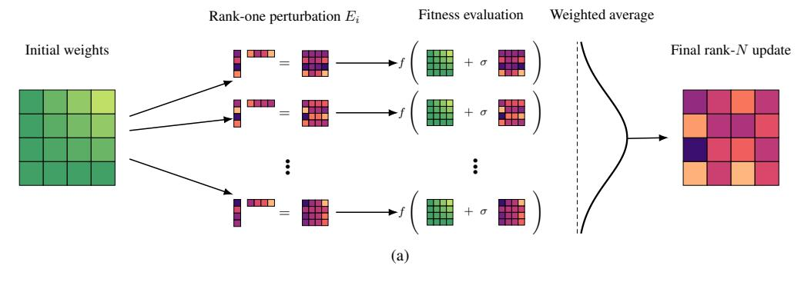

Figure 1: Schematic visualization of EGGROLL using N workers.

<sup>\*</sup>Equal Contribution † Core Contributor, sorted by alphabetical order in first names ‡Equal Senior Authors

<span id="page-1-0"></span>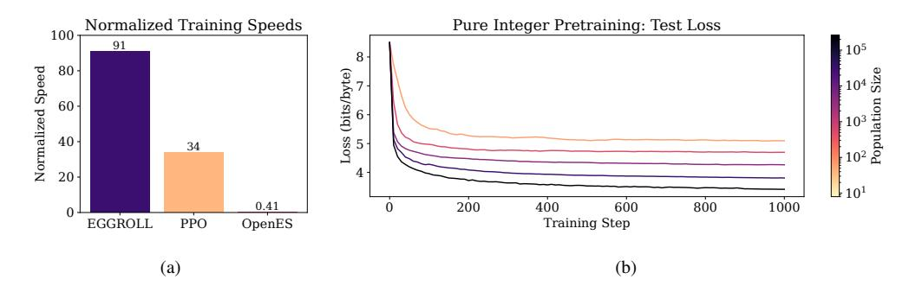

Figure 2: (a) Relative speed of our method, EGGROLL, in terms of experience throughput versus prior methods, where 100 represents the maximum batch throughput of pure inference. See Appendix F for more details. (b) We use EGGROLL to train RNN language models from scratch using only integer datatypes, scaling population size from 64 to 262144.

#### 1 Introduction

Evolution Strategies (ES) (Rechenberg, 1978; Beyer, 1995; Beyer & Schwefel, 2002) are an attractive alternative to first-order methods based on gradient backpropagation, for several reasons. First, ES does not require differentiability, so it can optimise a broader class of models, like models with discrete parametrisation spaces (cellular automata), and can optimize objectives where gradients are unavailable or noisy, like outcomeonly rewards in LLM fine-tuning (Qiu et al., 2025). Second, ES is more robust to noisy and ill-conditioned optimisation landscapes (Wierstra et al., 2011; Xue et al., 2021). Unlike gradients, population-based exploration smooths irregularities (Salimans et al., 2017), tolerates discontinuities, and mitigates issues like ill-conditioned curvature or vanishing and exploding gradients in long-range or recurrent settings (Hansen, 2023). Third, ES is highly amenable to scaling through parallelisation, since fitness evaluations are independent across population members and require only the communication of scalar fitnesses, which maps cleanly onto modern inference infrastructure and yields near-linear speedups on large clusters (Salimans et al., 2017). By contrast, backpropagation requires communicating and aggregating gradients across devices, yielding updates with high memory and computation costs. Additionally, backpropagation requires special care when training models with low-precision datatypes, whereas ES can directly optimize any model with the same datatypes used at inference time. Together, these properties position ES as a potentially powerful foundation for training large, discrete, or hybrid architectures, and end-to-end systems with non-differentiable components, including large language models (LLMs) (Brown et al., 2020; Chowdhery et al., 2023; Du et al., 2022; Fedus et al., 2022).

Despite this potential, there are practical obstacles to employing ES at scale. In deep learning architectures (Goodfellow et al., 2016), the majority of trainable parameters form linear mappings represented by matrices (Rosenblatt, 1962; Hochreiter & Schmidhuber, 1996; Bengio et al., 2000; Krizhevsky et al., 2012; Goodfellow et al., 2014; Kingma & Welling, 2014; Vaswani et al., 2017); naïvely adapting ES therefore requires generating full-rank matrix perturbations that replicate the entire parameter set for every population member. This inflates memory costs and forces frequent movement of large weight tensors. Evaluating these perturbations then requires a separate sequence of matrix multiplications per member, so the total compute and wall-clock time scale roughly with the population size and sequence length. In billion-parameter regimes, these two costs dominate, making it difficult to scale ES beyond small models or small populations (Qiu et al., 2025; Korotyshova et al., 2025).

To mitigate both memory and computational bottlenecks, we introduce Evolution Guided General Optimization via Low-rank Learning (EGGROLL), an ES algorithm that allows for the efficient training of neural network architectures with billions of parameters. Analogous to LoRA's low-rank adapters in gradient-based training (Hu et al., 2022), EGGROLL generates *low-rank* parameter-space perturbations for ES: instead of sampling a full-rank matrix  $E \in \mathbb{R}^{m \times n}$ , we sample  $A \in \mathbb{R}^{m \times r}$  and  $B \in \mathbb{R}^{n \times r}$  with  $r \ll \min(m, n)$  and form  $E = \frac{1}{\sqrt{r}}AB^{\top}$ . This reduces auxiliary perturbation matrix storage from mn to (m+n)r per layer, and proportionally reduces tensor movement. Moreover, we use a counter-based deterministic random number generator (RNG) (Salmon et al., 2011; Bradbury et al., 2018) to reconstruct noise on demand, so matrix

perturbations need not persist in memory. When evaluating the fitness of members of multiple perturbations in parallel, EGGROLL batches a population of low-rank adapters and shares the base activations, enabling a single forward pass that applies all  $AB^{\top}$  updates via specialized batched matrix multiplications. The compute required beyond standard batched inference scales with  $\mathcal{O}(r(n+m)N)$ , where N is the population size, instead of  $\mathcal{O}(nmN)$  for standard ES, yielding substantial memory and inference savings and making EGGROLL efficient for extremely large models. We emphasise that our method does not restrict the updates to be low-rank: the overall EGGROLL update is an average of rank r matrices across the population, making the matrix parameter update rank  $\min(Nr, m, n)$ .

EGGROLL is described in detail in Section 4. We provide a rigorous theoretical analysis of the low-rank approximation accuracy in Section 5, proving that EGGROLL updates converge to the full rank Gaussian ES updates at an  $\mathcal{O}(^1/r)$  rate. This fast convergence rate suggests that low-rank updates are sufficient to train large-scale architectures, even with  $r \ll \min(m,n)$ . In our extensive empirical evaluation, we test this hypothesis across a wide range of domains in Section 6. In tabula rasa and multi-agent RL (MARL) settings, we show that EGGROLL does not compromise performance compared to naïve ES despite being faster. To demonstrate the scalability of our method for LLM fine-tuning, we conduct experiments on pretrained RWKV7 (Peng et al., 2025) models, modern recurrent language models that enable large batch inference due to their constant state size. Finally, we develop a nonlinear RNN language model that operates purely in integer datatypes, and demonstrate that EGGROLL can stably pretrain this language model, a feat which is only feasible due to the large population sizes enabled by EGGROLL.

#### 2 Preliminaries

All proofs for theoretical results in this paper are found in the Appendix.

# 2.1 Low Rank Matrix Approximations

When adapting high dimensional foundation models for specific tasks, updating the parameters using gradient based methods has high memory requirements. LoRA uses low-rank approximations to the matrix multiplications to reduce these costs. For each matrix  $M_i \in \mathbb{R}^{m \times n}$  in the model, a low-rank approximation can be made by decomposing each matrix:

$$M_i \approx M_i^0 + A_i B_i^{\top},$$

where  $M_i^0 \coloneqq \operatorname{StopGrad}(M_i)$  is the imported matrix from the foundation model with frozen parameters and  $A_i \in \mathbb{R}^{m \times r}$  and  $B_i \in \mathbb{R}^{n \times r}$  are low-width column matrices (i.e.,  $r \ll \min(m,n)$ ) whose parameters are updated through gradient-based optimisation during task-specific adaptation. This reduces the number of optimisation parameters for each matrix from mn to r(m+n). In this paper, we use a similar low-rank matrix approximation for evolutionary strategies.

#### 2.2 Gaussian Matrix Distribution and Matrix Norms

In this paper, we focus on evolution strategies that target *matrix parameters*. Many variables we study are Gaussian distributed. When working in matrix space, it is convenient to use the matrix Gaussian distribution (Dawid, 1981), which is defined directly over matrices  $X \in \mathbb{R}^{m \times n}$ :

$$\mathcal{N}(M,U,V) = \frac{1}{(2\pi)^{\frac{mn}{2}}\det(U)^{\frac{n}{2}}\det(V)^{\frac{m}{2}}}\exp\left(-\frac{1}{2}\mathrm{tr}\left(V^{-1}(X-M)^{\top}U^{-1}(X-M)\right)\right),$$

where  $M \in \mathbb{R}^{m \times n}$  is the mean matrix,  $U \in \mathbb{R}^{m \times m}$  is the row covariance matrix and  $V \in \mathbb{R}^{n \times n}$  is the column covariance matrix. The matrix Gaussian distribution is a generalisation of the multivariate Gaussian distribution  $\mathcal{N}(\mu, \Sigma)$  defined over vector space. Sampling a matrix  $X \sim \mathcal{N}(M, U, V)$  from a Gaussian matrix distribution is equivalent to sampling a vector  $\text{vec}(X) \sim \mathcal{N}(\mu, \Sigma)$  from a multivariate Gaussian distribution with mean  $\mu = \text{vec}(M)$  and covariance matrix  $\Sigma = V \otimes U$  where  $\otimes$  denotes the Kronecker product. For isotropic matrix Gaussian distributions with covariance matrices  $U = \sigma^2 I_m$  and  $V = \sigma^2 I_n$ , the equivalent multivariate Gaussian distribution is also isotropic with  $\Sigma = \sigma^2 I_{mn}$ . To measure distance between matrices, we use the Frobenius norm:

$$||M||_F \coloneqq \sqrt{\sum_{i,j} m_{i,j}^2},$$

which provides an upper bound on the matrix 2-norm (Petersen & Pedersen, 2008). We denote the  $\ell^2$  vector norm as  $\|\cdot\|$ .

#### 2.3 Evolution strategies

Evolution strategies (ES) (Rechenberg, 1978; Beyer, 1995; Beyer & Schwefel, 2002) is a set of blackbox methods for optimising general systems. ES has emerged as a useful alternative to gradient-based methods, particularly when a system is noisy or non-differentiable. Our problem setting focuses on fitness functions whose parameters are matrices: our goal is to find a matrix  $M^\star \in \mathbb{R}^{m \times n}$  that maximises the fitness function  $M^\star \in \arg\max_{M \in \mathbb{R}^{m \times n}} f(M)$ . In comparison to gradient-based methods which use derivatives of the function f(M) to update the parameters M directly, evolutionary methods update a population distribution over the parameter space. This is achieved by learning a set of parameters  $\theta$  to maximise the expected fitness f(z) under a population distribution  $\pi(M|\theta)$ :

$$J(\theta) = \mathbb{E}_{M \sim \pi(M|\theta)} \left[ f(M) \right]. \tag{1}$$

Taking derivatives of  $J(\theta)$  yields the gradient:

$$\nabla_{\theta} J(\theta) = \mathbb{E}_{M \sim \pi(M|\theta)} \left[ \nabla_{M} \log \pi(M|\theta) f(M) \right],$$

which is used to update the population distribution's parameters using (stochastic) gradient ascent with a suitable stepsize  $\alpha_t$ :

<span id="page-3-1"></span>
$$\theta_{t+1} \leftarrow \theta_t + \alpha_t \nabla_\theta J(\theta_t). \tag{2}$$

 $\nabla_M \log \pi(M|\theta)$  is known as the score function, which avoids taking gradients directly through the fitness function in Eq. (1).

#### 2.4 Gaussian Matrix ES

In this paper, we study ES using Gaussian policies:  $\pi(M|\theta) = \mathcal{N}(\mu, I_m\sigma^2, I_n\sigma^2)$ . In addition to its mathematical convenience, the central limit theorem means that the Gaussian distribution emerges naturally from a low-rank approximation as rank increases, even if the matrices A and B are themselves non-Gaussian. We assume that  $\sigma^2$  is fixed and the ES algorithm optimises over the mean matrix  $\theta = \mu$  which acts as a proxy for the true maximum of the fitness function. By adapting well-known derivations (Wierstra et al., 2011) to the Gaussian matrix case, we derive the ES gradient for our problem setting:

**Proposition 1.** Using the Gaussian matrix policy  $\pi(M|\mu) = \mathcal{N}(\mu, I_m \sigma^2, I_n \sigma^2)$  the ES objective can be written as:

<span id="page-3-2"></span><span id="page-3-0"></span>
$$J(\mu) = \mathbb{E}_{E \sim P(E)} \left[ f(M = \mu + \sigma E) \right]. \tag{3}$$

and the matrix gradient of the ES objective is:

$$\nabla_{\mu} J(\mu) = -\frac{1}{\sigma} \mathbb{E}_{E \sim P(E)} \left[ E \cdot f(M = \mu + \sigma E) \right]. \tag{4}$$

where P(E) is a zero-mean standard normal  $p(E) = \mathcal{N}(0, I_m, I_n)$ . Moreover, the natural matrix gradient is equal to  $\sigma^2 \nabla_{\mu} J(\mu)$ , i.e. equivalent to Eq. (4) up to a factor of  $\sigma^2$ .

We see from Eq. (4) that Gaussian matrix ES methods optimise the objective  $J(\mu)$  by generating search matrices  $E \sim P(E)$  from a standard matrix normal distribution  $\mathcal{N}(0, I_m, I_n)$  around the parameter matrix  $\theta = \mu$ .

We remark that for Gaussian population distributions, the ES update in Eq. (4) is equal to the natural evolution stategy (NES) update up to a factor of  $\sigma^2$ . NES (Wierstra et al., 2008; 2011) updates follow the *natural gradient* (Amari, 1998; Kakade, 2001) of the objective in Eq. (1). This means that for our problem setting where  $\sigma$  is assumed fixed and is absorbed into the stepsize in Eq. (2), Gaussian matrix ES and NES are equivalent. A key benefit of the natural gradient is that it takes into account the local geometry of the underlying parameter space when updating the search distribution, making the updates invariant to the choice of parametrisation.

# 3 Related Work

#### 3.1 Evolutionary Algorithms

Evolutionary algorithms have long been a compelling alternative to backpropagation-based training methods. Despite encompassing a broad range of algorithms (e.g., genetic algorithms [\(Such et al.,](#page-15-7) [2018\)](#page-15-7) or symbolic evolution [\(Koza,](#page-13-6) [1994\)](#page-13-6)), most contemporary research on evolution has shifted towards algorithms that scale better to large numbers of neural network parameters [\(Jaderberg et al.,](#page-13-7) [2017;](#page-13-7) [Hansen & Ostermeier,](#page-12-5) [2001;](#page-12-5) [Salimans et al.,](#page-15-2) [2017\)](#page-15-2).

Our work focuses on evolving the weights of predetermined architectures, building up from the NES [\(Wierstra](#page-16-0) [et al.,](#page-16-0) [2011\)](#page-16-0) family of methods. Such an approach has recently grown in prominence, following the application of NES to policy learning in conventional RL environments [\(Salimans et al.,](#page-15-2) [2017\)](#page-15-2) to alleviate some of the challenges that policy-gradient methods struggle with, like long-horizon environments. Since then, evolution has been widely applied in other domains, such as meta-learning (e.g., [\(Lu et al.,](#page-14-0) [2022;](#page-14-0) [Metz et al.,](#page-14-1) [2022;](#page-14-1) [Lange](#page-13-8) [et al.,](#page-13-8) [2023;](#page-13-8) [Goldie et al.,](#page-12-6) [2024;](#page-12-6) [2025\)](#page-12-7)), hyperparameter tuning (e.g., [\(Parker-Holder et al.,](#page-14-2) [2021;](#page-14-2) [Tani et al.,](#page-15-8) [2021;](#page-15-8) [Vincent & Jidesh,](#page-16-4) [2023\)](#page-16-4)) and drug discovery [\(Towers et al.,](#page-16-5) [2025\)](#page-16-5). Here, we consider the limitations and solutions to applying ES at significant scale, beyond the small networks and population sizes of these prior works, with a broad focus on policy-learning. In particular, [Salimans et al.](#page-15-2) [\(2017\)](#page-15-2) uses a maximum population size of 1440, whereas our maximum population size is on the order of hundreds of thousands.

ES is limited by its requirement for full, potentially expensive evaluations of the fitness function due to simulating policies in long-horizon environments and potentially high memory usage. Persistent Evolution Strategies [\(Vicol et al.,](#page-16-6) [2021\)](#page-16-6) demonstrate a significant speedup by updating networks *online* (i.e., during the unroll), with followups offering further variance reduction [\(Li et al.,](#page-14-3) [2023b;](#page-14-3) [Vicol et al.,](#page-16-7) [2023\)](#page-16-7). We note that these works are orthogonal to our focus on scaling up the population size of ES; we leave the application of these techniques on top of EGGROLL to future work.

### 3.2 Evolution Strategies for LLMs

Although gradient backpropagation is typically used for LLM training and fine-tuning, prior work has explored ES variants for fine-tuning. In particular, zeroth order optimization [\(Zhang et al.,](#page-16-8) [2024\)](#page-16-8), which is analogous to ES with a population size of 1, is used by [Malladi et al.](#page-14-4) [\(2023\)](#page-14-4) for memory-efficient LLM fine-tuning. [Yu et al.](#page-16-9) [\(2025\)](#page-16-9) extend this approach by projecting perturbations to a low-rank subspace, improving the convergence of zeroth order optimization. [Jin et al.](#page-13-9) [\(2024\)](#page-13-9) performs ES directly on LoRA matrices. These works focus on the supervised fine-tuning setting, finding comparable performance to full fine-tuning, but they do not determine whether pretraining is possible with zeroth order methods; we find that large population sizes are necessary for pretraining performance, indicating that zeroth order optimization methods would be unsuitable for pretraining.

Recent work has also explored ES in the context of LLM reasoning. [Korotyshova et al.](#page-13-3) [\(2025\)](#page-13-3) first train LoRA adapters using supervised fine-tuning (SFT) before decomposing them into fixed SVD bases alongside singular values that are trained using CMA-ES. They achieve comparable performance to GRPO [\(Shao et al.,](#page-15-9) [2024\)](#page-15-9) in significantly less wall-clock time on math reasoning benchmarks. [Qiu et al.](#page-15-1) [\(2025\)](#page-15-1) directly use ES to optimize all LLM parameters for reasoning, with stronger performance than GRPO on the countdown reasoning task. However, both of these approaches use relatively small population sizes, on the order of a hundred unique perturbations per update, and instead collect hundreds of rollouts per perturbation to efficiently use GPUs. By contrast, our approach allows all generations to use different perturbations, such that our maximum population size per update is orders of magnitude larger (equal to the maximum inference batch size), without compromising token generation throughput.

# <span id="page-4-0"></span>4 EGGROLL

We now introduce and motivate our method EGGROLL, which is presented in Algorithm [1.](#page-5-0) In Section [4.1](#page-5-1) we derive a low-rank ES update that approximates a full-rank ES gradient. One practical issue with using a low-rank matrix approximation is that its distribution and score function have no analytic solution except for degenerate cases, so in Section [4.2](#page-5-2) we derive an alternative score function from the limiting high-rank Gaussian which we propose as an approximation.

#### <span id="page-5-1"></span>4.1 Low Rank Evolution Strategies

Recall the Gaussian matrix ES update from Eq. (4). Our goal is to introduce a tractable approximation to generating full-rank matrices, using low-rank matrices  $AB^{\top}$  as our search matrices instead. We denote the distribution of A as p(A) and B as p(B) assume that the elements of A and B are drawn independently:

<span id="page-5-3"></span>**Assumption 1.** Assume all elements  $a_{i,j} \in A$  and  $b_{i,j} \in B$  are continuous identically and independently distributed random variables according to some zeromean, symmetric, absolutely continuous (i.e., it has a density) distribution  $p_0(\cdot)$  with finite 4th order moments and variance  $0 < \sigma_0^2$ .

```
Algorithm 1 EGGROLL(r, \alpha, \sigma, T_{\text{max}}, N_{\text{workers}})
```

```
 \begin{array}{l} \text{ initialise } \mu \text{ and workers with known random seeds } \varsigma \\ \text{ for } T_{\max} \text{ timesteps } \textbf{do} \\ \text{ for Each worker } i \in \{1, \dots N_{\text{workers}}\} \text{ in parallel } \textbf{do} \\ A_i \sim p(A_i), B_i \sim p(B_i) \\ E_i \leftarrow \frac{1}{\sqrt{r}} A_i B_i^{\top} \\ f_i \leftarrow f(\mu + \sigma E_i) \\ \text{ end for} \\ \text{Workers share scalar fitness } f_i \text{ with other workers} \\ \text{ for Each worker } i \in \{1, \dots N_{\text{workers}}\} \text{ in parallel } \textbf{do} \\ \text{ Reconstruct } E_j \text{ for } j \in \{1, \dots N_{\text{workers}}\} \text{ from } \varsigma \\ \mu \leftarrow \mu + \alpha \frac{1}{N_{\text{Workers}}} \sum_{j=1}^{N_{\text{Workers}}} E_j f_j \\ \text{ end for} \\ \end{array}
```

The low-rank approximation  $AB^{\top}$  must be carefully integrated into the Gaussian matrix ES objective in Eq. (3) to ensure that the variance of the updates remains bounded with increasing number of columns r as the elements of  $AB^{\top}$  are a sum of r random variables. To counter this, we scale the outer product by  $\frac{1}{\sqrt{r}}$  which keeps the variance of  $E = \frac{1}{\sqrt{r}}AB^{\top}$  as  $\mathcal{O}(1)$ .

Observe that  $E=\frac{1}{\sqrt{r}}AB^{\top}$  maps to the manifold  $\mathbb{M}^r\subset\mathbb{R}^{m\times n}$  of rank r matrices, which is a subset of  $\mathbb{R}^{m\times n}$ . This means that the density p(E) is defined with respect to a unit volume over the manifold and cannot be defined with respect to the standard unit volume in Euclidean space as the volume of the manifold is zero using this measure. For the corresponding score function, gradients with respect to  $\log p(E)$  are defined over the tangent space to  $\mathbb{M}^r$  instead of in the usual Euclidean space. An intuitive reason for this is that there is dependence between elements of E and so it is not possible to take partial derivatives with respect to each element whilst keeping all other elements free. In principle it is possible to define all distributions and gradients with respect to the manifold  $\mathbb{M}^r$ , however this makes an analysis of low-rank updates difficult. Instead, we study the variable  $Z=\frac{1}{\sqrt{r}}AB^{\top}+\epsilon$  where  $\epsilon$  is an  $m\times n$  matrix with independent decaying Gaussian elements  $\epsilon_{i,j}\sim\mathcal{N}(0,\sigma_{\epsilon}^2/r)$ . The variable  $Z=\frac{1}{\sqrt{r}}AB^{\top}+\epsilon$  has a well-defined density p(Z) for all  $\sigma_{\epsilon}>0$ . This conceptual tool greatly simplifies analysis and as  $\sigma_{\epsilon}$  can be made arbitrarily small and hence p(E) can be arbitrarily close to p(Z), the difference between the update used in practice and the update analysed is negligible. Substituting for p(E)=p(Z) in Eq. (3), we derive the low-rank ES objective:

$$J_{LR}(\mu) = \mathbb{E}_{Z \sim p(Z)} \left[ f \left( M = \mu + \sigma Z \right) \right].$$

We now verify that p(z) is well-defined and show how  $J_{LR}(\mu)$  can be optimised using the score function of p(Z):

**Theorem 1.** Low-rank ES Gradient. Let Assumption 1 hold. Then for finite r:

$$g_{\mathit{LR}} \coloneqq \nabla_{\mu} J_{\mathit{LR}}(\mu) = -\frac{1}{\sigma} \mathbb{E}_{Z \sim p(Z)} \left[ \nabla_{Z} \log p\left(Z\right) f(M = \mu + \sigma Z) \right].$$

where Z is generated by sampling  $A \sim p(A), B \sim p(B), \epsilon \sim p(\epsilon)$  and making the transformation  $Z = \frac{1}{\sqrt{r}}AB^{\top} + \epsilon$ .

#### <span id="page-5-2"></span>4.2 Score Function Approximation

As the mapping  $(A, B, \epsilon) : \to Z = \frac{1}{\sqrt{r}} A B^\top + \epsilon$  is non-invertible, there does not exist a simple closed form solution for the density p(Z) and score function except in degenerate cases such as m = n = 1. Instead, we use an approximation for the score function  $\hat{S}(Z) \approx \nabla_Z \log p(Z)$ :

<span id="page-5-4"></span>
$$\hat{g}_{LR} = -\frac{1}{\sigma} \mathbb{E}_{Z \sim p(Z)} \left[ \hat{S}(Z) f(M = \mu + \sigma Z) \right]. \tag{5}$$

To optimise the ES objective using the EGGROLL update, we adapt the parallelised evolutionary strategies algorithm from Salimans et al. (2017). In our experiments and Algorithm 1, we use a Gaussian approximate

score function, which is obtained from taking the limit  $r \to \infty$ . As  $\epsilon$  is a random matrix formed of independent Gaussian elements, it can be decomposed into an equivalent sum of r independent Gaussian matrices:

$$\epsilon = \frac{1}{\sqrt{r}} \sum_{i=1}^{r} \epsilon_i,$$

where each random matrix  $\epsilon_i \sim p(\epsilon_i)$  has the same distribution as  $\epsilon$ . Likewise, the matrix  $AB^{\top}$  can be decomposed as a sum of independent, zero-mean vector outer products:

$$AB^{\top} = \sum_{i=1}^{r} a_i b_i^{\top},$$

where  $a_i$  and  $b_i$  are the *i*th column vectors of A and B. This allows us to write Z as a standardised sum of r independent random matrices:

$$Z = \frac{1}{\sqrt{r}} \sum_{i=1}^{r} \left( a_i b_i^{\top} + \epsilon_i \right). \tag{6}$$

Under Assumption 1, the central limit theorem proves that p(Z) converges in distribution to a Gaussian  $\mathcal{N}(0, I_m \sigma_0^4, I_n \sigma_0^4)$ . Using this limiting distribution in place of the true distribution p(Z), we obtain the Gaussian approximate score function:

<span id="page-6-2"></span><span id="page-6-1"></span><span id="page-6-0"></span>
$$\hat{S}(Z) = -\frac{1}{\sigma_0^4} Z. \tag{7}$$

We remark that EGGROLL is not wedded to any particular score function approximator and we derive and explore a set of mean-field approximators in Appendix B as alternatives, however our experiments show that the Gaussian approximator has the best overall performance on the set of tasks we evaluated on. We make a Monte Carlo estimate of expectation in Eq. (5) with  $N_{\rm workers}$  samples to optimise the parameters  $\mu$  using (approximate) stochastic gradient ascent. This yields the Gaussian EGGROLL update:

**EGGROLL UPDATE:** For each worker (in parallel), sample  $A_{i,t} \sim p(A_{i,t}), B_{i,t} \sim p(B_{i,t})$  and form low-rank perturbation  $E_{i,t} = \frac{1}{\sqrt{r}} A_{i,t} B_{i,t}^{\top}$ . Update matrix parameters using:

$$\mu_{t+1} = \mu_t + \frac{\alpha_t}{N_{\text{workers}}} \sum_{i=1}^{N_{\text{workers}}} E_{i,t} f(M = \mu_t + \sigma E_{i,t}). \tag{8}$$

Here we have absorbed the constants  $\frac{1}{\sigma}$  and  $\frac{1}{\sigma_0^4}$  into the tunable learning rate  $\alpha_t$ . As each random matrix  $E_{i,t}$  in Eq. (8) has rank r almost surely and the matrix is updated using a sum of  $N_{\text{worker}}$  such matrices, the overall EGGROLL matrix parameter update has rank  $\min(Nr, m, n)$  almost surely, meaning that the overall parameter update is not restricted to be low-rank. For all experiments in Section 6,  $Nr > \min(m, n)$ , meaning EGGROLL parameter updates are full-rank.

# 4.3 Hardware-Efficient EGGROLL Implementation

A key reason to use EGGROLL over standard ES is that large populations can be simulated in parallel on a GPU thanks to the low-rank perturbations. For the sake of exposition, we write equations from the perspective of a single worker, *i*, and explain in text how this corresponds to batched GPU operations.

Consider the task of computing a batched forward pass over inputs  $x_i \in \mathbb{R}^{d_{in}}$  for a linear layer with mean parameter  $\mu \in \mathbb{R}^{d_{out} \times d_{in}}$ . The standard forward pass is just a regular matrix multiplication,  $x\mu^T$ , since  $\mu$  is constant across all threads. However, naively applying ES by trying to compute  $x_i(\mu + \sigma E_i)^T$  becomes a batched matrix multiplication, which is inefficient on GPUs since every element of  $\mu + \sigma E_i$  is only used in a single multiplication, yielding poor arithmetic intensity.

However, with EGGROLL we know that  $x_i(\mu + \sigma E_i) = x_i\mu + \frac{\sigma}{\sqrt{r}}(x_iB_i)A_i^T$ . In this context, the bulk of compute is spent on the efficient calculation of  $x_i\mu$  using regular matrix multiplication. Meanwhile, when  $r=1, x_iB_i$  simply becomes an inexpensive batched vector-vector dot product to get a batch of scalars, which is then processed by a batched scalar-vector multiplication when multiplying by  $A_i^T$ . This decomposition is key to efficient batched LoRA inference, such as those used by vLLM (Kwon et al., 2023), which why EGGROLL achieves the same speeds as batched LoRA inference systems.

We additionally optimize the update process by not explicitly materializing the individual  $E_i$  in the computation of  $\sum_{i=1}^N E_i f_i$ , the key term in the Gaussian approximate score function. In particular, when the rank is 1, we reconstruct  $A \in \mathbb{R}^{N \times d_{out}}$  and  $B \in \mathbb{R}^{N \times d_{in}}$  and calculate the expression as  $(A \odot f)B^T$ , which is a simple matrix multiplication.

# <span id="page-7-0"></span>5 Approximation Analysis

We now analyse how fast the Gaussian score approximation from Eq. (7) converges to the true Gaussian ES matrix gradient in Eq. (4). We introduce the following formal regularity assumption for the fitness function:

<span id="page-7-1"></span>**Assumption 2.** Assume that f(M) is bounded, that is  $\sup_{M} |f(M)| < \infty$ .

Denote the true full-rank Gaussian ES gradient as  $g_{\text{True}} := \nabla_{\mu} J(\mu)$ . Our key theoretical result characterises the error rate between the Gaussian score approximator in the low-rank update  $\hat{g}_{\text{LR}}^r$  from Eq. (5) and the true gradient using the matrix Frobenius norm:

**Theorem 2.** Let Assumptions 1 and 2 hold and set  $\sigma_0 = 1$ , then:

$$\|\hat{g}_{LR}^r - g_{True}\|_F = \mathcal{O}\left(\frac{1}{r}\right). \tag{9}$$

The convergence rate in Eq. (9) is faster than the typical  $\mathcal{O}\left(^{1}/\sqrt{r}\right)$  rate dictated by the general parametric central limit theorem. Our analysis shows that this is due to the symmetry in our problem under Assumption 1. To obtain our results, we make an Edgeworth expansion (Bhattacharya & Ranga Rao, 1976) of the density  $p(Z^{r})$ , which expands  $p(Z^{r})$  as the limiting Gaussian distribution plus a sum of decaying terms that are controlled by the 3rd order and higher cumulants of  $p(Z^{r})$ . Each ith order cumulant term is multiplied by a factor that decays at rate  $\mathcal{O}\left(r^{-\frac{i-2}{2}}\right)$ . For symmetric zero-mean distributions, all odd cumulants are zero (for the same reason that all odd moments of a symmetric distribution are

<span id="page-7-3"></span><span id="page-7-2"></span>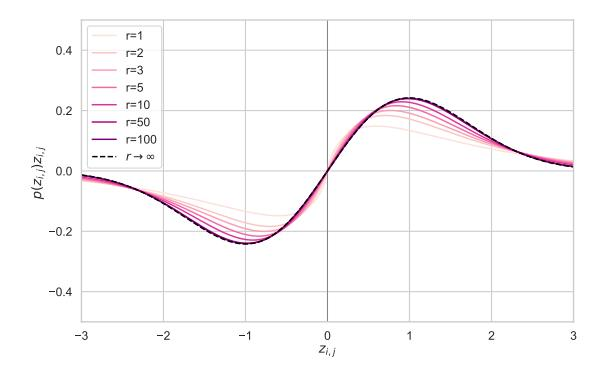

Figure 3: Plot of Marginal Score Multiplied by Density for Increasing r

zero). Hence, the rate of convergence to the limiting distribution is controlled by the 4th order term, which has rate  $\mathcal{O}(r^{-1})$ .

Although the full distribution  $p(Z^r)$  has no general closed-form solution, the distribution over marginals  $p(z_{i,j})$  is more amenable to analysis. We derive  $p(z_{i,j})$  for generalised Gaussian distributed  $a_{i,j}$  and  $b_{i,j}$  in Section B. To illustrate the fast converge rate, we plot the negative density  $\times$  score function  $p(z_{i,j})z_{i,j}$  for the marginal distribution  $p(z_{i,j})$  in Fig. 3 using Gaussian distributed  $a_{i,j}$  and  $b_{i,j}$  with  $\sigma_0^2=1$  (see Theorem 4 for a derivation). The figure shows that  $p(z_{i,j})z_{i,j}$  quickly converges to the limiting function  $\frac{z_{i,j}}{\sqrt{2\pi}}\exp\left(-\frac{z_{i,j}^2}{2}\right)$ , recovering the Gaussian form from the true natural policy gradient update. Even at r=1, the function is not a poor approximation. After r=10, the function has nearly converged and after r=50, the function is visually indistinguishable from the limit, providing evidence for the hypothesis that the low-rank approximation is accurate even for very low rank regimes  $r \ll \min(m,n)$ .

# <span id="page-8-0"></span>6 Experiments

### 6.1 Pure Integer Pretraining of an RNN Language Model

To demonstrate the potential of EGGROLL as a general optimization method, we study whether EGGROLL could be used for language model pretraining. Since EGGROLL does not rely on gradients, we can explicitly design a language model architecture to be efficient and hardware-friendly at inference time. In particular, we build a model under the following constraints to emphasize the flexibility of EGGROLL:

- 1. Pure Integer Training: On H100 systems, int8 is the fastest datatype, with int8 matrix multiplication with int32 accumulation being the fastest tensor core operation. Furthermore, integer datatypes are much simpler to implement in hardware, providing massive energy savings for high-throughput systems [\(Horowitz,](#page-13-11) [2014\)](#page-13-11). Therefore, we keep all weights in int8 and all activations in integer formats, *never* casting to floating point at any point during training.
- 2. Nonlinear RNN: Modern language models use sequence-parallel architectures like Transformers and SSMs, since they enable stable gradients without backpropagation through time. However, most of these sequence-parallel architectures are unable to handle simple state tracking [\(Merrill et al.,](#page-14-5) [2024\)](#page-14-5), whereas classic recurrent networks like LSTMs and GRUs can handle these problems with a single layer. Since EGGROLL does not require backpropagation through time, we can train on unbounded sequence lengths [\(Li et al.,](#page-14-6) [2023a\)](#page-14-6) with nonlinear RNNs of broader complexity classes. Specifically, we develop a variant of the minGRU model [\(Heck & Salem,](#page-13-12) [2017\)](#page-13-12) that performs all operations in integer formats.
- 3. Removal of all Activation Functions: Inspired by [Foerster](#page-12-8) [\(2017\)](#page-12-8), we remove all activation functions, like the rectified linear unit and hyperbolic tangent, due to the nonlinearity present in the int8 datatype. Specifically, the saturated addition of int8 values provides sufficient nonlinearity due to the implicit clipping of values to the int8 dynamic range, which evolution strategies can exploit.

We call the resulting language model EGG, the Evolved Generative GRU, an EGGROLL-friendly architecture. Its architecture is similar to standard pre-layernorm transformer decoder models, but we (1) use a variant of L1 normalization instead of L2 normalization for our layernorm to avoid square roots, (2) replace self-attention with our custom GRU, and (3) perform all operations in integer datatypes. See Appendix [C](#page-32-0) for more details on the architecture.

We train an EGG model with 6 layers and hidden dimension 256 to do character-level prediction on the minipile dataset [\(Kaddour,](#page-13-13) [2023\)](#page-13-13). We update parameters after 100 tokens for each population member, applying truncated ES by keeping the hidden state and only resetting at document boundaries. We plot the test loss in Fig. [2b](#page-1-0) over training steps across a range of population sizes, where the best test loss is 3.41 bits/byte. We find that training is stable and loss curves are relatively smooth, especially with large population sizes, avoiding loss spikes, nan values, and other instabilities associated with backprop-based training at low precision datatypes.

Note that our largest population size is 2 <sup>18</sup> = 262144, which is two orders of magnitude larger than the largest experiment done by [Salimans et al.](#page-15-2) [\(2017\)](#page-15-2) while only requiring a single GPU to train. We see that multiplying the population size by 8 results in the loss dropping by approximately 0.4 over the range of population values we have tested, though this pattern will eventually break since the loss must be strictly positive. We conduct more ablations in Appendix [E,](#page-35-0) determining how data efficient training can be achieved with EGGROLL and validating the importance of large batch sizes.

#### <span id="page-8-1"></span>6.2 Reinforcement Learning Tasks

In these experiments, we compare the performance of EGGROLL against standard OpenES as implemented in [Salimans et al.](#page-15-2) [\(2017\)](#page-15-2) on reinforcement learning tasks. Given the small network sizes, we can use Open ES at this scale, but we note that as network sizes increase, the use of vanilla OpenES becomes impossible. We use the standard formulation of simply optimizing for the final return in the environment. For both EGGROLL and OpenES, we perform hyperparameter optimization (HPO) separately for each environment. For each algorithm–environment pair, we define plausible ranges for all key hyperparameters based on prior work and preliminary experiments. We then perform 20 random search trials, where each trial corresponds to a single

<span id="page-9-0"></span>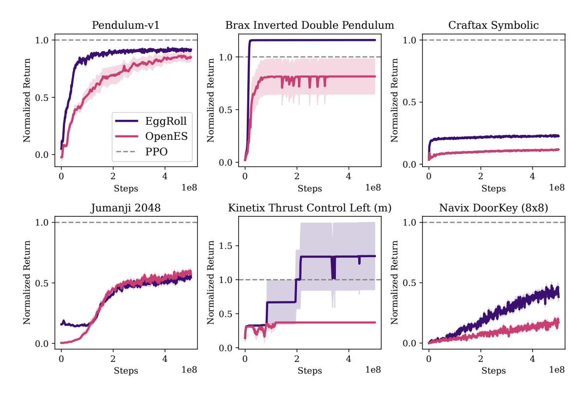

Figure 4: Comparison of reinforcement learning Mean returns normalized by PPO performance for 10 seeds. The returns are evaluated using the mean of the parameters. HPO was conducted for each algorithm/environment pair. The shaded region is the standard error of the mean .

training run with a randomly sampled hyperparameter configuration. Each configuration is evaluated based on the final return achieved by the mean policy parameters at the end of training. After all trials, we select the configuration that yields the highest final return. Using this best configuration, we then run 10 independent seeds to evaluate performance and report the mean and standard error of the mean across these seeds.

We use policy networks with 3 layers of 256 neurons and a range of environments that demonstrate different capabilities. We evaluate across the Navix (Pignatelli et al., 2024), Craftax (Matthews et al., 2024), Brax (Freeman et al., 2021), Kinetix (Matthews et al., 2025), and Jumanji (Bonnet et al., 2024) suites of environments. We evaluate 16 environments in total. To pick environments, we choose environments that are not trivial or impossible for PPO to solve, according to the original papers. We also choose environments that are part of different categories when these are available (e.g. environment size in Kinetix or categories in Jumanji).

We show a subsample of the environments that were evaluated in Fig. 4. The remaining environment results are in Appendix G.1. Our findings show that EGGROLL is competitive with Open ES on 7/16 environments, underperforms on 2/16, and outperforms on 7/16. This does not take into account the speed-ups when compared to using OpenES (full-rank updates). We postulate that the reason for this performance increase is that the large networks are difficult to optimize for Open ES and lend themselves well to low rank updates. All hyperparameter configuration details are available in Appendix G.1.

# 6.3 LLM Fine-tuning for Reasoning Tasks

We apply EGGROLL for LLM finetuning of RWKV-7 (Peng et al., 2025) models in two reasoning tasks: countdown and GSM8K. The RWKV architecture is a recurrent model that, compared to transformers, is especially suited to parallelization due to the fact that any memory otherwise spent on the KV cache can be used to evaluate population members. The training curves of EGGROLL and GRPO in countdown are shown in figure 5a. EGGROLL fine-tuning on an RWKV-7 1.5B model converges to a higher validation accuracy of 35% (v.s. 23%) under the same hardware and wall-clock time in the countdown task. Similarly, figure 5b

<span id="page-10-0"></span>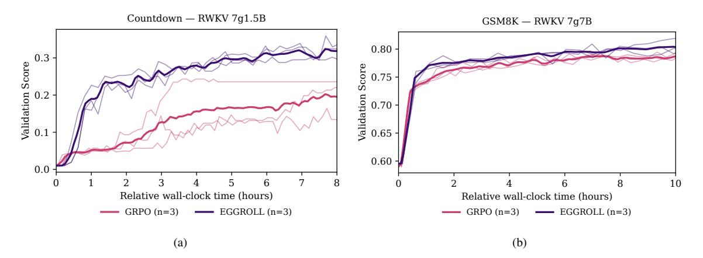

Figure 5: Comparison of the validation score of 3 seeds of EGGROLL v.s. 3 seeds of GRPO in: (a) Countdown task with an RWKV 7g1.5B model on a single GPU. EGGROLL allows 1024 parallel generations per GPU whereas GRPO only 64. (b) GSM8K task with an RWKV 7g7B model on 8 GPUs. EGGROLL allows 8096 parallel generations (1024 per GPU) whereas GRPO only 256 (32 per GPU).

shows that EGGROLL outperforms GRPO on GSM8K fine-tuning. Our scoring function draws parallels to the group relative advantage of GRPO. In particular, to score a set of noise directions,  $E \equiv \{E_1, \dots, E_n\}$ , we first compute their accuracies,  $\{s_{1,q_i}, \dots, s_{n,q_i}\}$ , on |q|=m questions, creating a matrix of scores  $S \in \mathbb{R}^{m \times n}$ . We then compute the z score per question, with the main difference that we use the global variance  $\bar{\sigma}$ , and average over all the questions to compute the final score for the noise direction  $E_i$ :

<span id="page-10-1"></span>
$$\bar{s}_i = \frac{1}{m} \sum_{j=1}^m z_{i,q_j} = \frac{1}{m} \sum_{j=1}^m \frac{s_{i,j} - \mu_{q_j}}{\bar{\sigma}}.$$

This scoring function has the purpose of weighting all questions within the same batch the same across population members.

#### 7 Conclusion

In this paper, we introduce EGGROLL, a powerful method for blackbox optimisation that scales evolutionary strategies to billion-parameter models and beyond using low-rank search matrices. Our experiments demonstrate that EGGROLL is effective with rank as small as r=1, which represents substantial computational and memory savings for negligible decrease in performance when compared to the full-rank ES update. Empirically, EGGROLL delivers large speedups over naïve ES in tabula rasa and multi-agent RL, and can power end-to-end training pipelines for large language models. Our theoretical analysis reveals that the low-rank EGGROLL update quickly converges with rank r, however further theoretical analysis is needed to explain the success of our method when r=1.

Looking forward, we are working on applying EGGROLL for other problems beyond the reach of modern gradient-based techniques. In particular, EGGROLL can enable the training of large scale end-to-end neurosymbolic systems (Sarker et al., 2021) which have nondifferentiable components. For instance, we can train neural networks that directly interface with symbolic modules for specialized functions, like memory or calculations. We can also optimize end-to-end systems of language models, training them to be aware of inference-time harnesses and interactions with other agents in complex systems.

#### Acknowledgements

Compute for this project is graciously provided by the Isambard-AI National AI Research Resource, under the projects "FLAIR 2025 Moonshot Projects" and "Robustness via Self-Play RL." Some experiments also used compute generously given by JASMIN, the UK's collaborative data analysis environment (https://www.jasmin.ac.uk).

Bidipta Sarkar is supported by the Clarendon Fund Scholarship in partnership with a Department of Engineering Science Studentship for his Oxford DPhil. Mattie Fellows is funded by a generous grant from the UKRI Engineering and Physical Sciences Research Council EP/Y028481/1. Jakob Nicolaus Foerster is partially funded by the UKRI grant EP/Y028481/1 (originally selected for funding by the ERC). Jakob Nicolaus Foerster is also supported by the JPMC Research Award and the Amazon Research Award. Juan Agustin Duque is supported by the St-Pierre-Larochelle Scholarship at the University of Montreal and by Aaron Courville's CIFAR AI Chair in Representations that Generalize Systematically. Lukas Seier is supported by the Intelligent Earth CDT with funding from the UKRI grant number EP/Y030907/1.

# References

- <span id="page-11-7"></span>Shun-ichi Amari. Natural gradient works efficiently in learning. *Neural Computation*, 10(2):251–276, 1998. doi: 10.1162/089976698300017746.
- <span id="page-11-10"></span>A. B. Basset. *A Treatise on Hydrodynamics: with numerous examples*, volume 2. Deighton, Bell, and Co., Cambridge, UK, 1892.
- <span id="page-11-4"></span>Yoshua Bengio, Réjean Ducharme, and Pascal Vincent. A neural probabilistic language model. In T. Leen, T. Dietterich, and V. Tresp (eds.), *Advances in Neural Information Processing Systems*, volume 13. MIT Press, 2000. URL [https://proceedings.neurips.cc/paper\\_files/paper/2000/](https://proceedings.neurips.cc/paper_files/paper/2000/file/728f206c2a01bf572b5940d7d9a8fa4c-Paper.pdf) [file/728f206c2a01bf572b5940d7d9a8fa4c-Paper.pdf](https://proceedings.neurips.cc/paper_files/paper/2000/file/728f206c2a01bf572b5940d7d9a8fa4c-Paper.pdf).
- <span id="page-11-0"></span>Hans-Georg Beyer. Toward a theory of evolution strategies: Self-adaptation. *Evolutionary Computation*, 3: 311–347, 1995. URL <https://api.semanticscholar.org/CorpusID:17416734>.
- <span id="page-11-1"></span>Hans-Georg Beyer and Hans-Paul Schwefel. Evolution strategies –a comprehensive introduction. *Natural Computing*, 1(1):3–52, 2002.
- <span id="page-11-8"></span>R. N. Bhattacharya and R. Ranga Rao. *Normal approximation and asymptotic expansions*. Wiley series in probability and mathematical statistics. Wiley, New York, 1976. ISBN 047107201X.
- <span id="page-11-9"></span>Clément Bonnet, Daniel Luo, Donal Byrne, Shikha Surana, Sasha Abramowitz, Paul Duckworth, Vincent Coyette, Laurence I. Midgley, Elshadai Tegegn, Tristan Kalloniatis, Omayma Mahjoub, Matthew Macfarlane, Andries P. Smit, Nathan Grinsztajn, Raphael Boige, Cemlyn N. Waters, Mohamed A. Mimouni, Ulrich A. Mbou Sob, Ruan de Kock, Siddarth Singh, Daniel Furelos-Blanco, Victor Le, Arnu Pretorius, and Alexandre Laterre. Jumanji: a diverse suite of scalable reinforcement learning environments in jax, 2024. URL <https://arxiv.org/abs/2306.09884>.
- <span id="page-11-5"></span>James Bradbury, Roy Frostig, Peter Hawkins, Matthew James Johnson, Chris Leary, Dougal Maclaurin, George Necula, Adam Paszke, Jake VanderPlas, Skye Wanderman-Milne, and Qiao Zhang. JAX: composable transformations of Python+NumPy programs, 2018. URL <http://github.com/jax-ml/jax>.
- <span id="page-11-2"></span>Tom B. Brown, Benjamin Mann, Nick Ryder, Melanie Subbiah, Jared Kaplan, Prafulla Dhariwal, Arvind Neelakantan, Pranav Shyam, Girish Sastry, Amanda Askell, Sandhini Agarwal, Ariel Herbert-Voss, Gretchen Krueger, Tom Henighan, Rewon Child, Aditya Ramesh, Daniel M. Ziegler, Jeffrey Wu, Clemens Winter, Christopher Hesse, Mark Chen, Eric Sigler, Mateusz Litwin, Scott Gray, Benjamin Chess, Jack Clark, Christopher Berner, Sam McCandlish, Alec Radford, Ilya Sutskever, and Dario Amodei. Language models are few-shot learners, 2020. URL <https://arxiv.org/abs/2005.14165>.
- <span id="page-11-3"></span>Aakanksha Chowdhery, Sharan Narang, Jacob Devlin, Maarten Bosma, Gaurav Mishra, Adam Roberts, Paul Barham, Hyung Won Chung, Charles Sutton, Sebastian Gehrmann, . . . , Barret Zoph, Liam Fedus, and . . . (full list). Palm: Scaling language modeling with pathways. *J. Mach. Learn. Res.*, 24(1144), 2023. URL <https://jmlr.org/papers/volume24/22-1144/22-1144.pdf>.
- <span id="page-11-6"></span>A. P. Dawid. Some matrix-variate distribution theory: Notational considerations and a bayesian application. *Biometrika*, 68(1):265–274, 1981. ISSN 0006-3444.

- <span id="page-12-1"></span>Nan Du, Yanping Huang, Andrew M. Dai, Simon Tong, Dmitry Lepikhin, Yuanzhong Xu, Maxim Krikun, Yanqi Zhou, Adams Wei Yu, Orhan Firat, Barret Zoph, Liam Fedus, Maarten P. Bosma, Zongwei Zhou, Tao Wang, Emma Wang, Kellie Webster, Marie Pellat, Kevin Robinson, Kathleen Meier-Hellstern, Toju Duke, Lucas Dixon, Kun Zhang, Quoc Le, Yonghui Wu, Zhifeng Chen, and Claire Cui. Glam: Efficient scaling of language models with mixture-of-experts. In *Proceedings of the 39th International Conference on Machine Learning*, volume 162 of *Proceedings of Machine Learning Research*, pp. 5547–5569, Jul 2022. URL <https://proceedings.mlr.press/v162/du22c.html>.
- <span id="page-12-10"></span>Richard Durrett. *Probability: Theory and Examples*. Cambridge University Press, Cambridge, UK, 4th edition, 2010.
- <span id="page-12-2"></span>William Fedus, Barret Zoph, and Noam Shazeer. Switch transformers: scaling to trillion parameter models with simple and efficient sparsity. *J. Mach. Learn. Res.*, 23(1):1–39, January 2022. ISSN 1532-4435. URL <https://jmlr.org/papers/volume23/21-0998/21-0998.pdf>.
- <span id="page-12-8"></span>Jakob Nicolaus Foerster. Nonlinear computation in deep linear networks, sep 2017. URL [https://blog.](https://blog.openai.com/nonlinear-computation-in-linear-networks/) [openai.com/nonlinear-computation-in-linear-networks/](https://blog.openai.com/nonlinear-computation-in-linear-networks/). Accessed: 2025-11-20.
- <span id="page-12-12"></span>Gerald B. Folland. *Real Analysis: Modern Techniques and Their Applications*. John Wiley & Sons, New York, 2nd edition, 1999. See Theorem 8.22 (Riemann–Lebesgue Lemma).
- <span id="page-12-9"></span>C. Daniel Freeman, Erik Frey, Anton Raichuk, Sertan Girgin, Igor Mordatch, and Olivier Bachem. Brax – a differentiable physics engine for large scale rigid body simulation, 2021. URL [https://arxiv.org/](https://arxiv.org/abs/2106.13281) [abs/2106.13281](https://arxiv.org/abs/2106.13281).
- <span id="page-12-6"></span>Alexander D. Goldie, Chris Lu, Matthew T. Jackson, Shimon Whiteson, and Jakob N. Foerster. Can Learned Optimization Make Reinforcement Learning Less Difficult? In *Advances in Neural Information Processing Systems*, volume 37, pp. 5454–5497, 2024.
- <span id="page-12-7"></span>Alexander David Goldie, Zilin Wang, Jaron Cohen, Jakob Nicolaus Foerster, and Shimon Whiteson. How Should We Meta-Learn Reinforcement Learning Algorithms? May 2025. URL [https://openreview.](https://openreview.net/forum?id=jKzQ6af2DU) [net/forum?id=jKzQ6af2DU](https://openreview.net/forum?id=jKzQ6af2DU).
- <span id="page-12-3"></span>Ian Goodfellow, Yoshua Bengio, and Aaron Courville. *Deep Learning*. MIT Press, 2016. [http://www.](http://www.deeplearningbook.org) [deeplearningbook.org](http://www.deeplearningbook.org).
- <span id="page-12-4"></span>Ian J. Goodfellow, Jean Pouget-Abadie, Mehdi Mirza, Bing Xu, David Warde-Farley, Sherjil Ozair, Aaron Courville, and Yoshua Bengio. Generative adversarial nets. In Z. Ghahramani, M. Welling, C. Cortes, N. Lawrence, and K.Q. Weinberger (eds.), *Advances in Neural Information Processing Systems*, volume 27. Curran Associates, Inc., 2014. URL [https://proceedings.neurips.cc/paper\\_](https://proceedings.neurips.cc/paper_files/paper/2014/file/f033ed80deb0234979a61f95710dbe25-Paper.pdf) [files/paper/2014/file/f033ed80deb0234979a61f95710dbe25-Paper.pdf](https://proceedings.neurips.cc/paper_files/paper/2014/file/f033ed80deb0234979a61f95710dbe25-Paper.pdf).
- <span id="page-12-14"></span>I. S. (Izrail Solomonovich) Gradshte˘ın, I. M. (Iosif Moiseevich) Ryzhik, Daniel Zwillinger, Victor Moll, and Inc Scripta Technica. *Table of integrals, series, and products*. Academic Press, San Diego ; Tokyo, 8 edition, 2015. ISBN 0123849330.
- <span id="page-12-13"></span>G R Grimmett and D R Stirzaker. Probability and random processes. *Journal of the Royal Statistical Society. Series A, Statistics in society*, 156(3):503–503, 1993. ISSN 0964-1998.
- <span id="page-12-11"></span>Peter Hall. *The bootstrap and Edgeworth expansion*. Springer series in statistics. Springer-Verlag, New York, 1992. ISBN 9780387945088.
- <span id="page-12-0"></span>Nikolaus Hansen. The cma evolution strategy: A tutorial, 2023. URL [https://arxiv.org/abs/1604.](https://arxiv.org/abs/1604.00772) [00772](https://arxiv.org/abs/1604.00772).
- <span id="page-12-5"></span>Nikolaus Hansen and Andreas Ostermeier. Completely Derandomized Self-Adaptation in Evolution Strategies. *Evolutionary Computation*, 9(2):159–195, June 2001. ISSN 1063-6560. doi: 10.1162/106365601750190398. URL <https://ieeexplore.ieee.org/document/6790628>.

- <span id="page-13-12"></span>Joel Heck and Fathi M. Salem. Simplified minimal gated unit variations for recurrent neural networks, 2017. URL <https://arxiv.org/abs/1701.03452>.
- <span id="page-13-0"></span>Sepp Hochreiter and Jürgen Schmidhuber. Lstm can solve hard long time lag problems. In M.C. Mozer, M. Jordan, and T. Petsche (eds.), *Advances in Neural Information Processing Systems*, volume 9. MIT Press, 1996. URL [https://proceedings.neurips.cc/paper\\_files/paper/1996/](https://proceedings.neurips.cc/paper_files/paper/1996/file/a4d2f0d23dcc84ce983ff9157f8b7f88-Paper.pdf) [file/a4d2f0d23dcc84ce983ff9157f8b7f88-Paper.pdf](https://proceedings.neurips.cc/paper_files/paper/1996/file/a4d2f0d23dcc84ce983ff9157f8b7f88-Paper.pdf).
- <span id="page-13-11"></span>Mark Horowitz. 1.1 computing's energy problem (and what we can do about it). In *2014 IEEE International Solid-State Circuits Conference Digest of Technical Papers (ISSCC)*, pp. 10–14, 2014. doi: 10.1109/ISSCC. 2014.6757323.
- <span id="page-13-4"></span>Edward J. Hu, Yelong Shen, Phillip Wallis, Zeyuan Allen-Zhu, Yuanzhi Li, Shean Wang, Lu Wang, and Weizhu Chen. Lora: Low-rank adaptation of large language models. In *ICLR*. OpenReview.net, 2022.
- <span id="page-13-7"></span>Max Jaderberg, Valentin Dalibard, Simon Osindero, Wojciech M. Czarnecki, Jeff Donahue, Ali Razavi, Oriol Vinyals, Tim Green, Iain Dunning, Karen Simonyan, Chrisantha Fernando, and Koray Kavukcuoglu. Population Based Training of Neural Networks, November 2017. URL [http://arxiv.org/abs/](http://arxiv.org/abs/1711.09846) [1711.09846](http://arxiv.org/abs/1711.09846). arXiv:1711.09846 [cs].
- <span id="page-13-9"></span>Feihu Jin, Yifan Liu, and Ying Tan. Derivative-free optimization for low-rank adaptation in large language models. *IEEE/ACM Trans. Audio, Speech and Lang. Proc.*, 32:4607–4616, October 2024. ISSN 2329-9290. doi: 10.1109/TASLP.2024.3477330. URL <https://doi.org/10.1109/TASLP.2024.3477330>.
- <span id="page-13-13"></span>Jean Kaddour. The minipile challenge for data-efficient language models. *arXiv preprint arXiv:2304.08442*, 2023.
- <span id="page-13-5"></span>Sham M Kakade. A natural policy gradient. In T. Dietterich, S. Becker, and Z. Ghahramani (eds.), *Advances in Neural Information Processing Systems*, volume 14. MIT Press, 2001. URL [https://proceedings.neurips.cc/paper\\_files/paper/2001/file/](https://proceedings.neurips.cc/paper_files/paper/2001/file/4b86abe48d358ecf194c56c69108433e-Paper.pdf) [4b86abe48d358ecf194c56c69108433e-Paper.pdf](https://proceedings.neurips.cc/paper_files/paper/2001/file/4b86abe48d358ecf194c56c69108433e-Paper.pdf).
- <span id="page-13-2"></span>Diederik P. Kingma and Max Welling. Auto-encoding variational bayes. In Yoshua Bengio and Yann LeCun (eds.), *2nd International Conference on Learning Representations, ICLR 2014, Banff, AB, Canada, April 14-16, 2014, Conference Track Proceedings*, 2014. URL <http://arxiv.org/abs/1312.6114>.
- <span id="page-13-3"></span>Daria Korotyshova, Boris Shaposhnikov, Alexey Malakhov, Alexey Khokhulin, Nikita Surnachev, Kirill Ovcharenko, George Bredis, Alexey Gorbatovski, Viacheslav Sinii, and Daniil Gavrilov. Essa: Evolutionary strategies for scalable alignment, 2025. URL <https://arxiv.org/abs/2507.04453>.
- <span id="page-13-6"></span>John R. Koza. Genetic programming as a means for programming computers by natural selection. *Statistics and Computing*, 4(2):87–112, June 1994. ISSN 1573-1375. doi: 10.1007/BF00175355. URL [https:](https://doi.org/10.1007/BF00175355) [//doi.org/10.1007/BF00175355](https://doi.org/10.1007/BF00175355).
- <span id="page-13-1"></span>Alex Krizhevsky, Ilya Sutskever, and Geoffrey E Hinton. Imagenet classification with deep convolutional neural networks. In F. Pereira, C.J. Burges, L. Bottou, and K.Q. Weinberger (eds.), *Advances in Neural Information Processing Systems*, volume 25. Curran Associates, Inc., 2012. URL [https://proceedings.neurips.cc/paper\\_files/paper/2012/file/](https://proceedings.neurips.cc/paper_files/paper/2012/file/c399862d3b9d6b76c8436e924a68c45b-Paper.pdf) [c399862d3b9d6b76c8436e924a68c45b-Paper.pdf](https://proceedings.neurips.cc/paper_files/paper/2012/file/c399862d3b9d6b76c8436e924a68c45b-Paper.pdf).
- <span id="page-13-10"></span>Woosuk Kwon, Zhuohan Li, Siyuan Zhuang, Ying Sheng, Lianmin Zheng, Cody Hao Yu, Joseph E. Gonzalez, Hao Zhang, and Ion Stoica. Efficient memory management for large language model serving with pagedattention. In *Proceedings of the ACM SIGOPS 29th Symposium on Operating Systems Principles*, 2023.
- <span id="page-13-8"></span>Robert Tjarko Lange, Tom Schaul, Yutian Chen, Tom Zahavy, Valentin Dallibard, Chris Lu, Satinder Singh, and Sebastian Flennerhag. Discovering Evolution Strategies via Meta-Black-Box Optimization, March 2023. URL <http://arxiv.org/abs/2211.11260>. arXiv:2211.11260 [cs].

- <span id="page-14-9"></span>Pierre-Simon Laplace. Mémoire sur les intégrales définies et leur application aux probabilités, et spécialement à la recherche du milieu qu'il faut choisir entre les résultats des observations. *Mémoires de la Classe des Sciences Mathématiques et Physiques de l'Institut Impérial de France,* 1 re série, 11(1re partie):297–347, 1811.
- <span id="page-14-12"></span>V. P. Leonov and A. N. Shiryaev. On a method of calculation of semi-invariants. *Theory of Probability and Its Applications*, 4(3):342–355, 1959. URL <https://www.mathnet.ru/eng/tvp4894>.
- <span id="page-14-6"></span>Oscar Li, James Harrison, Jascha Sohl-Dickstein, Virginia Smith, and Luke Metz. Variance-reduced gradient estimation via noise-reuse in online evolution strategies. In *Thirty-seventh Conference on Neural Information Processing Systems*, 2023a.
- <span id="page-14-3"></span>Oscar Li, James Harrison, Jascha Sohl-Dickstein, Virginia Smith, and Luke Metz. Noise-Reuse in Online Evolution Strategies, April 2023b. URL <http://arxiv.org/abs/2304.12180>. arXiv:2304.12180 [cs].
- <span id="page-14-14"></span>Jarek Liesen, Chris Lu, and Robert Lange. rejax, 2024. URL <https://github.com/keraJLi/rejax>.
- <span id="page-14-15"></span>Ryan Lowe, Aviv Tamar, Jean Harb, OpenAI Pieter Abbeel, and Igor Mordatch. Multi-agent actor-critic for mixed cooperative-competitive environments. *Advances in neural information processing systems*, 30, 2017.
- <span id="page-14-0"></span>Chris Lu, Jakub Kuba, Alistair Letcher, Luke Metz, Christian Schroeder de Witt, and Jakob Foerster. Discovered policy optimisation. *Advances in Neural Information Processing Systems*, 35:16455–16468, 2022.
- <span id="page-14-13"></span>H. M. Macdonald. Zeroes of the bessel functions. *Proceedings of the London Mathematical Society*, 30: 165–179, 1899. doi: 10.1112/plms/s1-30.1.165.
- <span id="page-14-4"></span>Sadhika Malladi, Tianyu Gao, Eshaan Nichani, Alex Damian, Jason D. Lee, Danqi Chen, and Sanjeev Arora. Fine-tuning language models with just forward passes. In *Proceedings of the 37th International Conference on Neural Information Processing Systems*, NIPS '23, Red Hook, NY, USA, 2023. Curran Associates Inc.
- <span id="page-14-7"></span>Michael Matthews, Michael Beukman, Benjamin Ellis, Mikayel Samvelyan, Matthew Jackson, Samuel Coward, and Jakob Foerster. Craftax: A lightning-fast benchmark for open-ended reinforcement learning. *arXiv preprint arXiv:2402.16801*, 2024.
- <span id="page-14-8"></span>Michael T. Matthews, Michael Beukman, Chris Lu, and Jakob Nicolaus Foerster. Kinetix: Investigating the training of general agents through open-ended physics-based control tasks. In *ICLR*, 2025. URL <https://openreview.net/forum?id=zCxGCdzreM>.
- <span id="page-14-10"></span>P. McCullagh. Cumulants (lecture notes). Lecture notes, University of Chicago (pdf), 2013. URL [https:](https://www.stat.uchicago.edu/~pmcc/courses/stat306/2013/cumulants.pdf) [//www.stat.uchicago.edu/~pmcc/courses/stat306/2013/cumulants.pdf](https://www.stat.uchicago.edu/~pmcc/courses/stat306/2013/cumulants.pdf).
- <span id="page-14-11"></span>Peter McCullagh. *Tensor Methods in Statistics*. Monographs on Statistics and Applied Probability. Chapman & Hall / CRC, London, 1987. URL [https://www.stat.uchicago.edu/~pmcc/tensorbook/](https://www.stat.uchicago.edu/~pmcc/tensorbook/DoverEdition.pdf) [DoverEdition.pdf](https://www.stat.uchicago.edu/~pmcc/tensorbook/DoverEdition.pdf). Discusses multivariate moments and cumulants (cumulant tensors).
- <span id="page-14-5"></span>William Merrill, Jackson Petty, and Ashish Sabharwal. The illusion of state in state-space models. In Ruslan Salakhutdinov, Zico Kolter, Katherine Heller, Adrian Weller, Nuria Oliver, Jonathan Scarlett, and Felix Berkenkamp (eds.), *Proceedings of the 41st International Conference on Machine Learning*, volume 235 of *Proceedings of Machine Learning Research*, pp. 35492–35506. PMLR, 21–27 Jul 2024. URL <https://proceedings.mlr.press/v235/merrill24a.html>.
- <span id="page-14-1"></span>Luke Metz, James Harrison, C. Daniel Freeman, Amil Merchant, Lucas Beyer, James Bradbury, Naman Agrawal, Ben Poole, Igor Mordatch, Adam Roberts, and Jascha Sohl-Dickstein. VeLO: Training Versatile Learned Optimizers by Scaling Up, November 2022. URL <http://arxiv.org/abs/2211.09760>. arXiv:2211.09760 [cs, math, stat].
- <span id="page-14-2"></span>Jack Parker-Holder, Vu Nguyen, and Stephen Roberts. Provably Efficient Online Hyperparameter Optimization with Population-Based Bandits, June 2021. URL <http://arxiv.org/abs/2002.02518>. arXiv:2002.02518 [cs].

- <span id="page-15-5"></span>Bo Peng, Ruichong Zhang, Daniel Goldstein, Eric Alcaide, Xingjian Du, Haowen Hou, Jiaju Lin, Jiaxing Liu, Janna Lu, William Merrill, Guangyu Song, Kaifeng Tan, Saiteja Utpala, Nathan Wilce, Johan S. Wind, Tianyi Wu, Daniel Wuttke, and Christian Zhou-Zheng. Rwkv-7 "goose" with expressive dynamic state evolution, 2025. URL <https://arxiv.org/abs/2503.14456>.
- <span id="page-15-6"></span>K. B. Petersen and M. S. Pedersen. The matrix cookbook, October 2008. URL [http://www2.imm.dtu.](http://www2.imm.dtu.dk/pubdb/p.php?3274) [dk/pubdb/p.php?3274](http://www2.imm.dtu.dk/pubdb/p.php?3274). Version 20081110.
- <span id="page-15-10"></span>Eduardo Pignatelli, Jarek Liesen, Robert Tjarko Lange, Chris Lu, Pablo Samuel Castro, and Laura Toni. Navix: Scaling minigrid environments with jax, 2024. URL <https://arxiv.org/abs/2407.19396>.
- <span id="page-15-1"></span>Xin Qiu, Yulu Gan, Conor F. Hayes, Qiyao Liang, Elliot Meyerson, Babak Hodjat, and Risto Miikkulainen. Evolution strategies at scale: Llm fine-tuning beyond reinforcement learning, 2025. URL [https://](https://arxiv.org/abs/2509.24372) [arxiv.org/abs/2509.24372](https://arxiv.org/abs/2509.24372).
- <span id="page-15-0"></span>I. Rechenberg. Evolutionsstrategien. In Berthold Schneider and Ulrich Ranft (eds.), *Simulationsmethoden in der Medizin und Biologie*, pp. 83–114, Berlin, Heidelberg, 1978. Springer Berlin Heidelberg. ISBN 978-3-642-81283-5.
- <span id="page-15-12"></span>V. K. Rohatgi. *An introduction to probability theory and mathematical statistics*. Wiley series in probability and mathematical statistics. Wiley, New York, 1976. ISBN 0471731358.
- <span id="page-15-3"></span>Frank. Rosenblatt. *Principles of neurodynamics : perceptrons and the theory of brain mechanisms.* Spartan Books, Washington, 1962.
- <span id="page-15-14"></span>Alexander Rutherford, Benjamin Ellis, Matteo Gallici, Jonathan Cook, Andrei Lupu, Gardar Ingvarsson, Timon Willi, Akbir Khan, Christian Schroeder de Witt, Alexandra Souly, et al. Jaxmarl: Multi-agent rl environments in jax. *arXiv preprint arXiv:2311.10090*, 2023.
- <span id="page-15-2"></span>Tim Salimans, Jonathan Ho, Xi Chen, Szymon Sidor, and Ilya Sutskever. Evolution strategies as a scalable alternative to reinforcement learning, 2017. URL <https://arxiv.org/abs/1703.03864>.
- <span id="page-15-4"></span>John K. Salmon, Mark A. Moraes, Ron O. Dror, and David E. Shaw. Parallel random numbers: As easy as 1, 2, 3. In *SC '11: Proceedings of 2011 International Conference for High Performance Computing, Networking, Storage and Analysis*, pp. 1–12, 2011. doi: 10.1145/2063384.2063405.
- <span id="page-15-11"></span>Md Kamruzzaman Sarker, Lu Zhou, Aaron Eberhart, and Pascal Hitzler. Neuro-symbolic artificial intelligence: Current trends, 2021. URL <https://arxiv.org/abs/2105.05330>.
- <span id="page-15-9"></span>Zhihong Shao, Peiyi Wang, Qihao Zhu, Runxin Xu, Junxiao Song, Xiao Bi, Haowei Zhang, Mingchuan Zhang, Y. K. Li, Y. Wu, and Daya Guo. Deepseekmath: Pushing the limits of mathematical reasoning in open language models, 2024. URL <https://arxiv.org/abs/2402.03300>.
- <span id="page-15-15"></span>Jasper Snoek, Hugo Larochelle, and Ryan P. Adams. Practical bayesian optimization of machine learning algorithms, 2012. URL <https://arxiv.org/abs/1206.2944>.
- <span id="page-15-7"></span>Felipe Petroski Such, Vashisht Madhavan, Edoardo Conti, Joel Lehman, Kenneth O. Stanley, and Jeff Clune. Deep Neuroevolution: Genetic Algorithms Are a Competitive Alternative for Training Deep Neural Networks for Reinforcement Learning, April 2018. URL <http://arxiv.org/abs/1712.06567>. arXiv:1712.06567 [cs].
- <span id="page-15-8"></span>Laurits Tani, Diana Rand, Christian Veelken, and Mario Kadastik. Evolutionary algorithms for hyperparameter optimization in machine learning for application in high energy physics. *The European Physical Journal C*, 81(2):170, February 2021. ISSN 1434-6044, 1434-6052. doi: 10.1140/epjc/s10052-021-08950-y. URL <http://arxiv.org/abs/2011.04434>. arXiv:2011.04434 [hep-ex].
- <span id="page-15-13"></span>Nico M Temme. *Bessel Functions*, chapter 9, pp. 219–255. John Wiley and Sons, Ltd, 1996. ISBN 9781118032572. doi: https://doi.org/10.1002/9781118032572.ch9. URL [https://onlinelibrary.](https://onlinelibrary.wiley.com/doi/abs/10.1002/9781118032572.ch9) [wiley.com/doi/abs/10.1002/9781118032572.ch9](https://onlinelibrary.wiley.com/doi/abs/10.1002/9781118032572.ch9).

- <span id="page-16-5"></span>Sebastian Towers, Aleksandra Kalisz, Philippe A. Robert, Alicia Higueruelo, Francesca Vianello, Ming-Han Chloe Tsai, Harrison Steel, and Jakob N. Foerster. ADIOS: Antibody Development via Opponent Shaping, June 2025. URL <http://arxiv.org/abs/2409.10588>. arXiv:2409.10588 [q-bio].
- <span id="page-16-2"></span>Ashish Vaswani, Noam Shazeer, Niki Parmar, Jakob Uszkoreit, Llion Jones, Aidan N Gomez, Ł ukasz Kaiser, and Illia Polosukhin. Attention is all you need. In I. Guyon, U. Von Luxburg, S. Bengio, H. Wallach, R. Fergus, S. Vishwanathan, and R. Garnett (eds.), *Advances in Neural Information Processing Systems*, volume 30. Curran Associates, Inc., 2017. URL [https://proceedings.neurips.cc/paper\\_](https://proceedings.neurips.cc/paper_files/paper/2017/file/3f5ee243547dee91fbd053c1c4a845aa-Paper.pdf) [files/paper/2017/file/3f5ee243547dee91fbd053c1c4a845aa-Paper.pdf](https://proceedings.neurips.cc/paper_files/paper/2017/file/3f5ee243547dee91fbd053c1c4a845aa-Paper.pdf).
- <span id="page-16-6"></span>Paul Vicol, Luke Metz, and Jascha Sohl-Dickstein. Unbiased gradient estimation in unrolled computation graphs with persistent evolution strategies. In Marina Meila and Tong Zhang (eds.), *Proceedings of the 38th International Conference on Machine Learning*, volume 139 of *Proceedings of Machine Learning Research*, pp. 10553–10563. PMLR, 18–24 Jul 2021. URL [https://proceedings.mlr.press/](https://proceedings.mlr.press/v139/vicol21a.html) [v139/vicol21a.html](https://proceedings.mlr.press/v139/vicol21a.html).
- <span id="page-16-7"></span>Paul Vicol, Zico Kolter, and Kevin Swersky. Low-Variance Gradient Estimation in Unrolled Computation Graphs with ES-Single, April 2023. URL <http://arxiv.org/abs/2304.11153>. arXiv:2304.11153 [cs, stat].
- <span id="page-16-4"></span>Amala Mary Vincent and P. Jidesh. An improved hyperparameter optimization framework for AutoML systems using evolutionary algorithms. *Scientific Reports*, 13(1):4737, March 2023. ISSN 2045-2322. doi: 10.1038/s41598-023-32027-3. URL <https://doi.org/10.1038/s41598-023-32027-3>.
- <span id="page-16-11"></span>G. N. Watson. *A Treatise on the Theory of Bessel Functions*. Cambridge University Press, Cambridge, 2 edition, 1944. Reprinted with corrections, various later printings.
- <span id="page-16-12"></span>G. B. Whitham. *Linear and nonlinear waves*. Pure and applied mathematics. Wiley-Interscience, New York, 1999. ISBN 9786613306241.
- <span id="page-16-3"></span>Daan Wierstra, Tom Schaul, Jan Peters, and Jürgen Schmidhuber. Natural evolution strategies. pp. 3381–3387, 06 2008. doi: 10.1109/CEC.2008.4631255.
- <span id="page-16-0"></span>Daan Wierstra, Tom Schaul, Tobias Glasmachers, Yi Sun, and Jürgen Schmidhuber. Natural evolution strategies, 2011. URL <https://arxiv.org/abs/1106.4487>.
- <span id="page-16-10"></span>C.S. Withers. A simple expression for the multivariate hermite polynomials. *Statistics and Probability Letters*, 47(2):165–169, 2000. ISSN 0167-7152. doi: https://doi.org/10.1016/S0167-7152(99)00153-4. URL <https://www.sciencedirect.com/science/article/pii/S0167715299001534>.
- <span id="page-16-1"></span>Ke Xue, Chao Qian, Ling Xu, and Xudong Fei. Evolutionary gradient descent for non-convex optimization. In Zhi-Hua Zhou (ed.), *Proceedings of the Thirtieth International Joint Conference on Artificial Intelligence, IJCAI-21*, pp. 3221–3227. International Joint Conferences on Artificial Intelligence Organization, 8 2021. doi: 10.24963/ijcai.2021/443. URL <https://doi.org/10.24963/ijcai.2021/443>. Main Track.
- <span id="page-16-9"></span>Ziming Yu, Pan Zhou, Sike Wang, Jia Li, Mi Tian, and Hua Huang. Zeroth-order fine-tuning of llms in random subspaces. In *Proceedings of the IEEE/CVF International Conference on Computer Vision (ICCV)*, pp. 4475–4485, October 2025.
- <span id="page-16-8"></span>Yihua Zhang, Pingzhi Li, Junyuan Hong, Jiaxiang Li, Yimeng Zhang, Wenqing Zheng, Pin-Yu Chen, Jason D. Lee, Wotao Yin, Mingyi Hong, Zhangyang Wang, Sijia Liu, and Tianlong Chen. Revisiting zeroth-order optimization for memory-efficient llm fine-tuning: A benchmark, 2024.

# Appendix

| A | Proofs |                                                    | 19 |
|---|--------|----------------------------------------------------|----|
|   | A.1    | ES Matrix Gradient Deviations                      | 19 |
|   | A.2    | Error Rate Analysis                                | 21 |
| B |        | Mean Field Score Function Approximator             | 27 |
|   | B.1    | Bessel Functions<br>                               | 27 |
|   | B.2    | Derivation of Mean-field Approximators             | 28 |
| C |        | EGG Architecture                                   | 33 |
|   | C.1    | Notation and Operations<br>                        | 33 |
|   | C.2    | Parameter Initialization                           | 33 |
|   | C.3    | Matrix Multiplication                              | 34 |
|   | C.4    | Embedding<br>                                      | 34 |
|   | C.5    | Layer Normalization (LN)<br>                       | 34 |
|   | C.6    | MLP                                                | 35 |
|   | C.7    | GRU                                                | 35 |
|   | C.8    | Fitness Calculation in Integer Types<br>           | 35 |
| D |        | EGG Pretraining with Integer EGGROLL               | 35 |
|   | D.1    | Adding EGGROLL Perturbations<br>                   | 36 |
|   | D.2    | Fitness Shaping                                    | 36 |
|   | D.3    | Parameter Update                                   | 36 |
| E |        | EGG Ablations                                      | 36 |
|   | E.1    | Data Efficient Training<br>                        | 36 |
|   | E.2    | Controlling For Data Across Population Sizes       | 37 |
| F |        | EGGROLL Speed                                      | 38 |
| G |        | Experimental Details                               | 38 |
|   | G.1    | Reinforcement Learning Experiments<br>             | 38 |
|   | G.2    | Multi Agent Reinforcement Learning Experiments<br> | 39 |
|   | G.3    | Reasoning Fine-tuning Experiments: Countdown<br>   | 41 |
|   | G.4    | Reasoning Fine-tuning Experiments: GSM8K           | 43 |

#### <span id="page-18-0"></span>A Proofs

In our proofs, we use the integral notation  $\int$  to denote the integral over the corresponding  $\mathbb{R}^d$  space, for example, for a matrix  $E \in \mathbb{R}^{m \times n}$ ,  $\int f(E) dE = \int_{\mathbb{R}^{m \times n}} f(E) dE$  and for a vector  $E \in \mathbb{R}^{mn}$ ,  $\int f(v) dv = \int_{\mathbb{R}^{mn}} f(v) dv$ .

#### <span id="page-18-1"></span>A.1 ES Matrix Gradient Deviations

**Proposition 1.** Using the Gaussian matrix policy  $\pi(M|\mu) = \mathcal{N}(\mu, I_m \sigma^2, I_n \sigma^2)$  the ES objective can be written as:

$$J(\mu) = \mathbb{E}_{E \sim P(E)} \left[ f(M = \mu + \sigma E) \right].$$

and the matrix gradient of the ES objective is:

$$\nabla_{\mu} J(\mu) = -\frac{1}{\sigma} \mathbb{E}_{E \sim P(E)} \left[ E \cdot f(M = \mu + \sigma E) \right].$$

where P(E) is a zero-mean standard normal  $p(E) = \mathcal{N}(0, I_m, I_n)$ . Moreover, the natural matrix gradient is equal to  $\sigma^2 \nabla_{\mu} J(\mu)$ , i.e. equivalent to Eq. (4) up to a factor of  $\sigma^2$ .

*Proof.* We start by deriving the derivative of the ES objective from Eq. (1). Taking the derivative with respect to  $\mu$ :

$$\nabla_{\mu} J(\mu) = \int f(M) \nabla_{\mu} \pi(M|\mu) dM,$$
$$= \int f(M) \nabla_{\mu} \log \pi(M|\mu) \pi(M|\mu) dM.$$

Now.

$$\nabla_{\mu} \log \pi(M|\mu) = \nabla_{\mu} - \frac{1}{2\sigma^{2}} \operatorname{tr} \left( (M - \mu)^{\top} (M - \mu) \right),$$
$$= -\frac{1}{\sigma^{2}} (M - \mu),$$

where we have used Petersen & Pedersen (2008, Eq. 103) for the matrix derivative of the trace, hence:

$$\nabla_{\mu}J(\mu) = -\frac{1}{\sigma} \int \frac{(M-\mu)}{\sigma} f(M) \, \pi(M|\mu) dM.$$

We make the transformation of variables  $E = \frac{M-\mu}{\sigma}$ :

$$\nabla_{\mu}J(\mu) = -\frac{1}{\sigma}\int E \cdot f(M)p(E)dE,$$

where

$$\begin{split} p(E) = & \sigma^{mn} \pi \left( M = \mu + \sigma E | \mu \right) \\ = & \frac{1}{(2\pi)^{\frac{mn}{2}}} \exp \left( -\frac{1}{2} \text{tr} \left( E^{\top} E \right) \right), \\ = & \mathcal{N}(0, I_m, I_n), \end{split}$$

as required. Using the same transformation of variables, the alternative form of the matrix Gaussian ES objective follows immediately:

$$J(\mu) = \int f(M)\pi(M|\mu)dM,$$
  
= 
$$\int f(M = \mu + \sigma E)P(E)dE.$$

We now derive the natural policy gradient for a Gaussian policy to prove our final claim. It is convenient to work in vector space rather than matrix space. In vector form, the natural gradient is defined as  $F(\mu_v)^{-1}\nabla_{\mu_v}J(\mu_v)$  where  $F(\mu_v)$  is the Fisher information matrix of the distribution:

$$F(\mu_v) := \mathbb{E}_{v \sim \pi(v|\mu_v)} \left[ \nabla_{\mu_v} \log \pi(v|\mu_v) \nabla_{\mu_v} \log \pi(v|\mu_v)^\top \right],$$

where  $\mu_v = \text{vec}(M)$  and  $\pi(v|\mu_v) = \mathcal{N}(\mu_v, \sigma^2 I_{mn})$  for our Gaussian case. Deriving the score function:

$$\nabla_{\mu_v} \log \pi(v | \mu_v) = -\frac{1}{2\sigma^2} \nabla_{\mu_v} ||\mu_v - v||^2,$$
  
=  $\frac{1}{\sigma^2} (v - \mu_v),$ 

Hence the Fisher information matrix is:

$$F(\mu_v) = \frac{1}{\sigma^4} \mathbb{E}_{v \sim \pi(v|\mu_v)} \left[ (v - \mu_v)(v - \mu_v)^\top \right],$$
  
$$= \frac{1}{\sigma^2} I_{mn}.$$

This yields the natural gradient:

$$F(\mu_v)^{-1} \nabla_{\mu_v} J(\mu_v) = \sigma^2 \nabla_{\mu_v} J(\mu_v).$$

Converting back to matrix form, the natural gradient is thus  $\sigma^2 \nabla_{\mu} J(\mu)$  as required.

**Theorem 1.** Let Assumption 1 hold. Then for finite r:

$$g_{LR} := \nabla_{\mu} J_{LR}(\mu) = -\frac{1}{\sigma} \mathbb{E}_{Z \sim p(Z)} \left[ \nabla_{Z} \log p(Z) f(y = (\mu + \sigma Z)x) \right].$$

where Z is generated by sampling  $A \sim p(A), B \sim p(B), \epsilon \sim p(\epsilon)$  and making the transformation  $Z = \frac{AB^\top}{\sqrt{r}} + \epsilon$ .

*Proof.* We first prove that the density p(Z) of the pushforward distribution of p(A), p(B) and  $p(\epsilon)$  under the mapping  $(A,B,\epsilon):\to Z=\frac{AB^\top}{\sqrt{r}}+\epsilon$  exists. As r is finite,  $p(\epsilon)$  is a Gaussian with well-defined density and Z is a sum two independent variables  $\frac{AB^\top}{\sqrt{r}}$  and  $\epsilon$ . The density p(Z) is thus given by the convolution (see, for example, Durrett (2010, Theorem 2.1.11)):

$$p(Z) = \mathbb{E}_{A \sim p(A), B \sim p(B)} \left[ p\left(\epsilon = Z - \frac{AB^{\top}}{\sqrt{r}}\right) \right],$$

which integrates to 1 over  $\mathbb{R}^{m \times n}$  and, since  $p(\epsilon)$  is everywhere positive, is also everywhere positive. The distribution of Z is thus absolutely continuous with respect to the Lebesgue measure in  $\mathbb{R}^{m \times n}$  and the density p(Z) is well-defined. To derive the gradient, we make the transformation of variables  $Z' = \mu + \sigma Z$ :

$$J_{LR}(\mu) = \int p(Z')f(y = Z'x)dZ',$$

where  $p(Z') = \frac{1}{\sigma^{mn}} p(Z = \frac{Z' - \mu}{\sigma})$  Taking derivatives with respect to  $\mu$ :

$$\begin{split} \nabla_{\mu} J_{\text{LR}}(\mu) &= \int \frac{1}{\sigma^{mn}} \nabla_{\mu} p \left( Z = \frac{Z' - \mu}{\sigma} \right) f(y = Z'x) dZ', \\ &= \int p(Z') \nabla_{\mu} \log p \left( Z = \frac{Z' - \mu}{\sigma} \right) f(y = Z'x) dZ'. \end{split}$$

From the chain rule:

$$\nabla_{\mu} \log p \left( Z = \frac{Z' - \mu}{\sigma} \right) = -\frac{1}{\sigma} \nabla_{Z} \log p \left( Z = \frac{Z' - \mu}{\sigma} \right),$$

hence:

$$\nabla_{\mu} J_{LR}(\mu) = -\frac{1}{\sigma} \int p(Z') \nabla_{Z} \log p \left( Z = \frac{Z' - \mu}{\sigma} \right) f(y = Z'x) dZ'.$$

Making the reverse transformation of variables  $Z = \frac{Z' - \mu}{\sigma}$ :

$$\nabla_{\mu} J_{LR}(\mu) = -\frac{1}{\sigma} \int p(Z) \nabla_{Z} \log p(Z) f(y = (\mu + \sigma Z)x) dZ,$$
$$= -\frac{1}{\sigma} \mathbb{E}_{Z \sim p(Z)} \left[ \nabla_{Z} \log p(Z) f(y = (\mu + \sigma Z)x) \right],$$

as required.

#### <span id="page-20-0"></span>A.2 Error Rate Analysis

For convenience, we work with random vectors in our analysis. Using the vec operator, we analyse the vector  $v^r = \text{vec}(Z^r)$  where:

$$\operatorname{vec}(M) = [m_{1,1}, \dots m_{1,m}, m_{2,1}, \dots m_{m,n}]^{\top}.$$

For a vector  $v \in \mathbb{R}^{mn}$ , we define the mat operator as:

so mat(vec(M)) = M. Using Eq. (6), write  $v^r$  as a standardised sum of r independent, zero-mean random vectors. Let

$$u_i = \operatorname{vec}\left(a_i b_i^{\top} + \epsilon_i\right),\tag{10}$$

where recall  $a_i$  and  $b_i$  are the *i*th column vectors of A and B and  $\epsilon_i$  is an  $m \times n$  random matrix with independent Gaussian elements drawn from  $\mathcal{N}(0, \sigma_{\epsilon}^2/r)$ , so:

<span id="page-20-2"></span>
$$v^r = \frac{1}{\sqrt{r}} \sum_{i=1}^r u_i^r.$$

We will use the fact that the Frobenius norm becomes the  $\ell$ -2 norm in vector space:

$$||M||_F = \sqrt{\sum_{i,j} m_{i,j}^2} = \sqrt{\sum_k \operatorname{vec}(M)_k^2} = ||\operatorname{vec}(M)||.$$
 (11)

Denoting the covariance matrix of p(u) as  $\Sigma^r$ , the central limit theorem proves that the distribution of  $v^r$  converges in distribution to a zero-mean Gaussian  $\mathcal{N}(0,\Sigma_r)$ . In Lemma 1, derive the covariance matrix for  $\Sigma^r$ . Our analysis uses an Edgeworth expansion (Bhattacharya & Ranga Rao, 1976) to characterise precisely the rate at which  $p(v^r)$  converges to the limiting Gaussian distribution. In Lemma 2, we make an Edgeworth expansion of  $p(v^r)$  to show that it is dominated by  $\mathcal{O}\left(\frac{1}{r}\right)$  terms and higher. These are then used to prove Lemma 3, which allows us to bound the integral of the remainder of the Edgeworth expansion, thereby characterising how fast  $p(v^r)$  converges to the limiting Gaussian distribution.

<span id="page-20-1"></span>**Lemma 1.** Let Assumption 1 hold and u be defined in Eq. (10). Then the variable u has diagonal covariance matrix:

$$\Sigma^r = \left(\sigma_0^4 + \frac{\sigma_\epsilon^2}{r}\right) I_{mn} =: \sigma_r^2 I_{mn},$$

Moreover, the variable u has a finite 4th-order absolute moment:

$$\mathbb{E}_{u \sim p(u)} \left[ \|u\|^4 \right] < \infty.$$

*Proof.* Under the vec operator, the vector u can be written element wise as:

$$u = [a_1b_1 + \epsilon_{1,1}, a_2b_1 + \epsilon_{2,1}, \dots a_mb_1 + \epsilon_{m,1}, a_1b_2 + \epsilon_{1,2}, \dots a_mb_n + \epsilon_{m,n}]^{\top}.$$

We note that all elements in the vector u have zero mean, and so the covariance matrix is the expectation of the outer product:

<span id="page-21-1"></span>
$$\Sigma^r = \mathbb{E}_{u \sim p(u)} \left[ u u^\top \right].$$

The diagonal elements of  $\Sigma^r$  are:

$$\mathbb{E}_{a_i,b_j,\epsilon_{j,i}}\left[(a_ib_j + \epsilon_{j,i})^2\right] = \mathbb{E}_{a_i,b_j,\epsilon_{j,i}}\left[a_i^2b_j^2 + 2a_ib_j\epsilon_{j,i} + (\epsilon_{j,i})^2\right],$$

$$= \mathbb{E}_{a_i,b_j}\left[a_i^2b_j^2\right] + \mathbb{E}_{\epsilon_{j,i}}\left[(\epsilon_{j,i})^2\right],$$

$$= \sigma_0^4 + \frac{\sigma_\epsilon^2}{r}.$$
(12)

As all elements of a, b and  $\epsilon$  are zero-mean, off-diagonal elements are zero:

$$\mathbb{E}_{a_{i},b_{j},a_{k},b_{l},\epsilon_{j,i},\epsilon_{k,l}} \left[ (a_{i}b_{j} + \epsilon_{j,i}) \left( a_{k}b_{l} + \epsilon_{k,l} \right) \right]$$

$$= \mathbb{E}_{a_{i},b_{j},a_{k},b_{l}} \left[ a_{i}b_{j}a_{k}b_{l} \right] + \mathbb{E}_{a_{i},b_{j},\epsilon_{k,l}} \left[ a_{i}b_{j}\epsilon_{k,l} \right]$$

$$+ \mathbb{E}_{a_{k},b_{l},\epsilon_{j,i}} \left[ a_{k},b_{l},\epsilon_{j,i} \right] + \mathbb{E}_{\epsilon_{j,i},\epsilon_{l,k}} \left[ \epsilon_{j,i}\epsilon_{k,l} \right],$$

$$= \mathbb{E}_{a_{i},b_{j},a_{k},b_{l}} \left[ a_{i}b_{j}a_{k}b_{l} \right] + \mathbb{E}_{\epsilon_{j,i},\epsilon_{l,k}} \left[ \epsilon_{j,i}\epsilon_{k,l} \right],$$

$$= 0 \quad i \neq k \text{ or } j \neq l.$$

$$(13)$$

Using Eqs. (12) and (13), our first result follows:

<span id="page-21-3"></span><span id="page-21-2"></span>
$$\Sigma^r = \left(\sigma_0^4 + \frac{\sigma_\epsilon^2}{r}\right) I_{mn}.$$

Now, as u is a vector of elements which are sums and products of variables which all have finite 4th order moments from Assumption 1, it immediately follows that u has finite 4th order absolute moments.

Using Lemma 1, we see the asymptotic Gaussian density of  $v^r$  is:

$$g(v^r) = \frac{1}{\sqrt{(2\pi)^{mn}\sigma_r^2}} \exp\left(-\frac{\|v^r\|^2}{2\sigma_r^2}\right).$$
(14)

We now derive a 4th order Edgeworth expansion for  $p(v^r)$  and its score function, which expands  $p(v^r)$  in terms of the limiting distribution  $g(v^r)$  plus remainder terms. Our proof reveals that 3rd order cumulants control all terms in the expansion that decay at rate  $\mathcal{O}\left(\frac{1}{\sqrt{r}}\right)$ . As 3rd order cumulants are all zero due to symmetry in Assumption 1, the overall decay rate is controlled by  $\mathcal{O}\left(\frac{1}{r}\right)$  terms associated with 4th order cumulants. It is for this reason that we obtain a faster convergence rate than the standard central limit theorem.

<span id="page-21-0"></span>**Lemma 2.** Let Assumption 1 hold and let  $v^r = vec(Z^r)$  and  $u_i$  be defined in Eq. (10). Let  $g(v^r)$  denote limiting Gaussian density in Eq. (14). Then, the Egdeworth expansion of  $p(v^r)$  is:

$$p(v^r) = g(v^r) + \frac{1}{4!r}g(v^r) \sum_{i,j,k,l} \kappa_{i,j,k,l}^4 H_{i,j,k,l}(v^r, \sigma_r) + \rho(v^r),$$

where:

$$H_{i,j,k,l}(v^r,\sigma_r) \coloneqq \exp\left(\frac{\|v^r\|^2}{2\sigma_r^2}\right) \frac{\partial^4}{\partial v_i^r \partial v_j^r \partial v_k^r \partial v_l^r} \exp\left(-\frac{\|v^r\|^2}{2\sigma_r^2}\right)$$

is a 4th order Hermite polynomial for  $g(v^r)$  (Laplace, 1811; Hall, 1992; Withers, 2000) and  $\rho(v^r)$  is o  $\left(\frac{1}{r}\right)$ .

*Proof.* We denote the characteristic function of  $p(u_i^r)$  as:

$$\varphi_{U^r}(\omega) = \int \exp\left(-i\omega^\top u\right) p(u) du.$$

Now, make the transformation of variables  $x_i^r = \frac{u_i^r}{\sqrt{r}}$ , hence  $p(x_i^r) = \sqrt{r}p(u_i^r = \sqrt{r}x_i^r)$  and denote the characteristic function of  $x_i^r$  as  $\varphi_{X^r}(\omega)$ . Using the time-scaling property of the Fourier transform, we can derive the characteristic function of  $x_i^r$  in terms of  $\varphi_{U^r}(\omega)$ :

$$\varphi_{X^r}(\omega) = \int \exp\left(-i\omega^\top x\right) p(x) dx, 
= \sqrt{r} \int \exp\left(-i\omega^\top x\right) p(u = \sqrt{r}x) dx, 
= \sqrt{r} \int \frac{1}{\sqrt{r}} \exp\left(-i\omega^\top \frac{u}{\sqrt{r}}\right) p(u) du, 
= \int \exp\left(-i\omega^\top \frac{u}{\sqrt{r}}\right) p(u) du, 
= \varphi_{U^r}\left(\frac{\omega}{\sqrt{r}}\right).$$
(15)

Now, as  $v^r = \sum_{i=1}^r x_i^r$ , we use the property that the density of a sum of r independent random variables is given by the r-fold convolution of the individual PDFs. As convolution in the spatial domain is equal to multiplication in the frequency domain, the density  $p(v^r)$  is:

<span id="page-22-0"></span>
$$p(v^r) = \mathcal{F}^{-1} \left[ (\varphi_{X^r})^r \right] (v^r),$$
  

$$= \mathcal{F}^{-1} \left[ \exp\left(r \log \varphi_{X^r}\right) \right] (v^r),$$
  

$$= \mathcal{F}^{-1} \left[ \exp\left(r K_X^r\right) \right] (v^r),$$
(16)

where  $K_X^r(\omega) := \log \varphi_{X^r}(\omega)$  is the *cumulant generating function* (also known as the second characteristic function) for  $X_i^r$ . From Eq. (15):

<span id="page-22-2"></span><span id="page-22-1"></span>
$$K_X^r(\omega) = \log \varphi_{X^r}(\omega),$$

$$= \log \varphi_{U^r} \left(\frac{\omega}{\sqrt{r}}\right),$$

$$= K_{U^r} \left(\frac{\omega}{\sqrt{r}}\right),$$

where  $K_{U^r}(\cdot)$  is the cumulant generating function for  $u_i^r$ . We now make a 4th order Taylor series expansion of  $rK_{U^r}\left(\frac{\omega}{\sqrt{r}}\right)$  about  $\omega=0$ :

$$rK_{Ur}\left(\frac{\omega}{\sqrt{r}}\right) = r\underbrace{K_{Ur}(0)}_{=\log 1=0} + \sqrt{r} \sum_{i} \omega_{i} \frac{\partial K_{Ur}(\omega=0)}{\partial \omega_{i}} + \frac{1}{2!} \sum_{i,j} \omega_{i} \omega_{j} \frac{\partial^{2} K_{Ur}(\omega=0)}{\partial \omega_{i} \partial \omega_{j}} + \frac{1}{3!\sqrt{r}} \sum_{i,j,k} \omega_{i} \omega_{j} \omega_{k} \frac{\partial^{3} K_{Ur}(\omega=0)}{\partial \omega_{i} \partial \omega_{j} \partial \omega_{k}} + \frac{1}{4!r} \sum_{i,j,k,l} \omega_{i} \omega_{j} \omega_{k} \omega_{l} \frac{\partial^{4} K_{Ur}(\omega=0)}{\partial \omega_{i} \partial \omega_{j} \partial \omega_{k}} + o\left(\frac{1}{r}\right),$$

$$= \sqrt{r} \sum_{i} \omega_{i} \kappa_{i}^{1} + \frac{1}{2!} \sum_{i,j} \omega_{i} \omega_{j} \kappa_{i,j}^{2} + \frac{1}{3!\sqrt{r}} \sum_{i,j,k} \omega_{i} \omega_{j} \omega_{k} \kappa_{i,j,k}^{3} + \frac{1}{4!r} \sum_{i,j,k,l} \omega_{i} \omega_{j} \omega_{k} \omega_{l} \kappa_{i,j,k,l}^{4} + o\left(\frac{1}{r}\right),$$

$$= \sqrt{r} \sum_{i} \omega_{i} \kappa_{i}^{1} + \frac{1}{2!} \sum_{i,j} \omega_{i} \omega_{j} \kappa_{i,j}^{2} + \frac{1}{3!\sqrt{r}} \sum_{i,j,k} \omega_{i} \omega_{j} \omega_{k} \kappa_{i,j,k}^{3} + \mathcal{R}(\omega), \tag{17}$$

where  $\kappa_{\cdot}^n$  is an *n*-th order cumulant (i.e.  $\kappa_i^n \coloneqq \frac{\partial K_{Ur}(\omega=0)}{\partial \omega_i}$ ) and

$$\mathcal{R}(\omega) := \frac{1}{4!r} \sum_{i,j,k,l} \omega_i \omega_j \omega_k \omega_l \kappa_{i,j,k,l}^4 + o\left(\frac{1}{r}\right),$$

denotes the 4th order polynomial and  $o\left(\frac{1}{r}\right)$  denotes the higher order remainder terms. We now state some facts about cumulants to simplify the above expansion. For a symmetric random vector like  $u^r$  under Assumption 3, all odd-order cumulants are zero, i.e.  $\kappa^i_{\cdot}=0$  for odd i (McCullagh, 2013; 1987). The second-order cumulant term coincides with the covariance matrix product:  $\sum_{i,j} \omega_i \omega_j \kappa_{i,j}^2 = -\omega^{\top} \Sigma^r \omega$  (McCullagh, 1987). Moreover, as 4th order moments of  $u^r$  exist from Lemma 1 then all cumulants up to including order 4 exist since cumulants are polynomial functions of the moments (Leonov & Shiryaev, 1959; McCullagh, 1987). Finally, we use  $\omega^{\top} \Sigma^r \omega = \|\omega\|^2 \sigma_r^2$  from Lemma 1. Substituting these results into Eq. (17) and using  $\mathcal{R}(\omega)$  to denote yields:

$$rK_{U^r}\left(\frac{\omega}{\sqrt{r}}\right) = -\frac{\|\omega\|^2 \sigma_r^2}{2} + \mathcal{R}(\omega),$$

$$\implies \exp\left(rK_X^r(\omega)\right) = \exp\left(-\frac{\|\omega\|^2 \sigma_r^2}{2} + \mathcal{R}(\omega)\right),$$

$$= \exp\left(-\frac{\|\omega\|^2 \sigma_r^2}{2}\right) \exp\left(\mathcal{R}(\omega)\right),$$

$$= \exp\left(-\frac{\|\omega\|^2 \sigma_r^2}{2}\right) \left(1 + \mathcal{R}(\omega) + o\left(\frac{1}{r}\right)\right),$$

$$= \exp\left(-\frac{\|\omega\|^2 \sigma_r^2}{2}\right) \left(1 + \frac{1}{4!r} \sum_{i,j,k,l} \omega_i \omega_j \omega_k \omega_l \kappa_{i,j,k,l}^4 + o\left(\frac{1}{r}\right)\right),$$

where we have used the Taylor series expansion of  $\exp(x)$  about x=0 to derive the fourth line. Substituting into Eq. (16) yields:

$$\begin{split} p(v^r) &= \int \exp(i\omega^\top v^r) \exp\left(rK_X^r(\omega)\right) d\omega, \\ &= \int \exp(i\omega^\top v^r) \exp\left(-\frac{\|\omega\|^2 \sigma_r^2}{2}\right) \left(1 + \frac{1}{4!r} \sum_{i,j,k,l} \omega_i \omega_j \omega_k \omega_l \kappa_{i,j,k,l}^4 + o\left(\frac{1}{r}\right)\right) d\omega, \\ &= \int \exp(i\omega^\top v^r) \exp\left(-\frac{\|\omega\|^2 \sigma_r^2}{2}\right) d\omega \\ &+ \frac{1}{4!r} \sum_{i,j,k,l} \kappa_{i,j,k,l}^4 \int \omega_i \omega_j \omega_k \omega_l \exp(i\omega^\top v^r) \exp\left(-\frac{\|\omega\|^2 \sigma_r^2}{2}\right) d\omega + o\left(\frac{1}{r}\right), \\ &= \int \exp(i\omega^\top v^r) \exp\left(-\frac{\|\omega\|^2 \sigma_r^2}{2}\right) d\omega \\ &+ \frac{1}{4!r} \sum_{i,j,k,l} \kappa_{i,j,k,l}^4 \frac{\partial^4}{\partial v_i^r \partial v_j^r \partial v_k^r \partial v_l^r} \int \exp(i\omega^\top v^r) \exp\left(-\frac{\|\omega\|^2 \sigma_r^2}{2}\right) d\omega + o\left(\frac{1}{r}\right). \end{split}$$

Now, recognising that  $\exp\left(-\frac{\|\omega\|^2\sigma_r^2}{2}\right)$  is the characteristic function for  $g(v^r)$  yields our desired result:

$$\begin{split} p(v^r) &= \mathcal{F}^{-1}[\mathcal{F}[g]](v^r) + \frac{1}{4!r} \sum_{i,j,k,l} \kappa_{i,j,k,l}^4 \frac{\partial^4}{\partial v_i^r \partial v_j^r \partial v_k^r \partial v_l^r} \mathcal{F}^{-1}[\mathcal{F}[g]](v^r) + o\left(\frac{1}{r}\right), \\ &= g(v^r) + \frac{1}{4!r} \sum_{i,j,k,l} \kappa_{i,j,k,l}^4 \frac{\partial^4}{\partial v_i^r \partial v_j^r \partial v_k^r \partial v_l^r} g(v^r) + o\left(\frac{1}{r}\right), \\ &= g(v^r) + \frac{1}{4!r} g(v^r) \sum_{i,j,k,l} \kappa_{i,j,k,l}^4 H_{i,j,k,l}(v^r,\sigma_r) + \rho(v^r), \end{split}$$

where *ρ*(*v r* ) denotes the remainder terms.

We now provide uniform bounds on the remainder term of the expansion using the techniques of [\(Bhattacharya](#page-11-8) [& Ranga Rao,](#page-11-8) [1976,](#page-11-8) Theorem 19.2) and analyse convergence rate of the limiting Gaussian distribution to a unit Gaussian:

<span id="page-24-0"></span>Lemma 3. *Let σ*<sup>0</sup> <sup>2</sup> = 1*, let g*(*v r* ) *be the limiting Gaussian from Eq.* [\(14\)](#page-21-3)*, let f*(*v r* ) *be a bounded function and let g*∞(*v r* ) = N (0*, Imn*)*. Let Assumptions [1](#page-5-3) and [2](#page-7-1) hold and let v <sup>r</sup>* = *vec*(*Z r* ) *and u<sup>i</sup> be defined in Eq.* [\(10\)](#page-10-1)*. Define the Edgeworth remainder as:*

$$R(v^r) = p(v^r) - g(v^r).$$

*Then:*

$$\int f(v^r)v^r R(v^r) dv^r = \mathcal{O}\left(\frac{1}{r}\right),$$
$$\int v^r f(v^r)g(v^r) dv^r = \int v^r f(v^r)g_{\infty}(v^r) dv^r + \mathcal{O}\left(\frac{1}{r}\right).$$

*Proof.* We start by bounding R *f*(*v r* )*v <sup>r</sup>R*(*v r* )*dv<sup>r</sup>* . From Lemma [2,](#page-21-0) we have shown that the Edgeworth expansion for *p*(*v r* ) is controlled by 4th order cumulants and higher, that is;

$$p(v^r) = g(v^r) + \frac{1}{4!r}g(v^r) \sum_{i,j,k,l} \kappa_{i,j,k,l}^4 H_{i,j,k,l}(v^r, \sigma_r) + \rho(v^r).$$
(18)

We show that the three assumptions needed to apply [Bhattacharya & Ranga Rao](#page-11-8) [\(1976,](#page-11-8) Theorem 20.1) to obtain our result using Eq. [\(18\)](#page-24-1). Firstly, the boundedness assumption of the integrand holds:

<span id="page-24-1"></span>
$$\sup_{v^r} \frac{\|f(v^r)v^r\|}{1+\|v^r\|} \leq \sup_{v^r} f(v^r) < \infty.$$

Secondly, the sampling regularity assumption that *u<sup>i</sup>* (as defined in Eq. [\(10\)](#page-10-1)) is zero-mean i.i.d. (satisfied under Assumption [1\)](#page-5-3) with finite 4th order moments (satisfied from Lemma [1\)](#page-20-1) holds. Let *φ<sup>U</sup>* (*ω*) denote the characteristic function of *p*(*u*), then the final assumption we need to verify is Cramer's condition: lim sup<sup>∥</sup>*ω*∥→∞ *φ<sup>U</sup>* (*ω*) *<* 1, which is satisfied from the Riemann-Lebesgue lemma [Folland](#page-12-12) [\(1999,](#page-12-12) Theorem 8.22) because *p*(*u*) is absolutely continuous under Assumption [1\)](#page-5-3). Our first result thus follows from applying [Bhattacharya & Ranga Rao](#page-11-8) [\(1976,](#page-11-8) Theorem 20.1):

$$\int f(v^r)v^r R(v^r)dv^r = \mathcal{O}\left(\frac{1}{r}\right).$$

We now derive our second result. Let *d* := *mn* 2 . As *g*∞(*v r* ) and *g*(*v r* ) are both Gaussians:

$$\begin{split} g_{\infty}(v^r)^{-1}g(v^r) &= \left(\frac{1}{\sigma_r}\right)^d \exp\left(\frac{\|v^r\|^2}{2} - \frac{\|v^r\|^2}{2\sigma_r^2}\right), \\ &= \left(\frac{r}{r + \sigma_\epsilon^2}\right)^d \exp\left(\frac{\|v^r\|^2}{2} - \frac{r\|v^r\|^2}{2(r + \sigma_\epsilon^2)}\right), \\ &= \left(\frac{r}{r + \sigma_\epsilon^2}\right)^d \exp\left(\frac{\sigma_\epsilon^2 \|v^r\|^2}{2(r + \sigma_\epsilon^2)}\right), \\ &= \left(\frac{r}{r + \sigma_\epsilon^2}\right)^d \left(1 + \exp\left(\frac{\sigma_\epsilon^2 \|v^r\|^2}{2(r + \sigma_\epsilon^2)}\right) - 1\right), \end{split}$$

where we have substituted for *σ<sup>r</sup>* <sup>2</sup> = 1 + *<sup>σ</sup><sup>ϵ</sup>* 2 *r* from Lemma [1,](#page-20-1) hence:

$$\int v^r f(v^r) g(v^r) dv^r = \int v^r f(v^r) g_{\infty}(v^r) g_{\infty}(v^r)^{-1} g(v^r) dv^r,$$

$$= \int v^r f(v^r) g_{\infty}(v^r) \left(\frac{r}{r + \sigma_{\epsilon}^2}\right)^d \left(1 + \exp\left(\frac{\sigma_{\epsilon}^2 ||v^r||^2}{2(r + \sigma_{\epsilon}^2)}\right) - 1\right) dv^r.$$

Expanding  $\left(\frac{r}{r+\sigma_{\epsilon}^2}\right)^d$  using the binomial expansion:

$$\left(\frac{r}{r+\sigma_{\epsilon}^{2}}\right)^{d} = \left(1 - \frac{\sigma_{\epsilon}^{2}}{r+\sigma_{\epsilon}^{2}}\right)^{d},$$

$$= 1 - \frac{d\sigma_{\epsilon}^{2}}{r+\sigma_{\epsilon}^{2}} + o\left(\frac{d\sigma_{\epsilon}^{2}}{r+\sigma_{\epsilon}^{2}}\right),$$

$$= 1 + \mathcal{O}\left(\frac{1}{r}\right),$$

hence:

$$\int v f(v^r) g(v^r) dv^r = \int v^r f(v^r) g_{\infty}(v^r) g_{\infty}(v^r)^{-1} g(v^r) dv^r,$$

$$= \left(1 + \mathcal{O}\left(\frac{1}{r}\right)\right) \int v^r f(v^r) g_{\infty}(v^r) \left(1 + \exp\left(\frac{\sigma_{\epsilon}^2 ||v^r||^2}{2(r + \sigma_{\epsilon}^2)}\right) - 1\right) dv^r.$$

It therefore suffices to show:

$$\int v^r f(v^r) g(v^r) \left( \exp\left( \frac{\sigma_{\epsilon}^2 ||v^r||^2}{2(r + \sigma_{\epsilon}^2)} \right) - 1 \right) dv^r = \mathcal{O}\left( \frac{1}{r} \right).$$

Using the identity  $\exp(x) - 1 \le x \exp(x)$  for  $x \ge 0$ :

$$\begin{split} \left\| \int v^r f(v^r) g(v^r) \left( \exp\left(\frac{\sigma_{\epsilon}^2 \|v^r\|^2}{2(r + \sigma_{\epsilon}^2)}\right) - 1 \right) dv^r \right\| \\ &\leq \int |f(v^r)| \|v\| g_{\infty}(v^r) \frac{\sigma_{\epsilon}^2 \|v^r\|^2}{2(r + \sigma_{\epsilon}^2)} \exp\left(\frac{\sigma_{\epsilon}^2 \|v^r\|^2}{2(r + \sigma_{\epsilon}^2)}\right) dv^r \\ &= \int g_{\infty}(v^r) \frac{\sigma_{\epsilon}^2 |f(v^r)| \|v^r\|^3}{2(r + \sigma_{\epsilon}^2)} \exp\left(\frac{\sigma_{\epsilon}^2 \|v^r\|^2}{2(r + \sigma_{\epsilon}^2)}\right) dv^r \\ &= \int \frac{1}{(2\pi)^d} \frac{\sigma_{\epsilon}^2 |f(v^r)| \|v^r\|^3}{2(r + \sigma_{\epsilon}^2)} \exp\left(-\frac{\|v^r\|^2}{2} + \frac{\sigma_{\epsilon}^2 \|v^r\|^2}{2(r + \sigma_{\epsilon}^2)}\right), \\ &\leq \sup_{v} |f(v^r)| \frac{(2\pi)^d \sigma_{\epsilon}^2}{2(r + \sigma_{\epsilon}^2)} \underbrace{\int \|v^r\|^3 \exp\left(-\frac{\|v^r\|^2}{2} \left(\frac{r}{r + \sigma_{\epsilon}^2}\right)\right) dv^r}_{=\mathcal{O}(1)}, \end{split}$$

$$&= \mathcal{O}\left(\frac{1}{r}\right), \end{split}$$

where our final line follows from the fact that fixed polynomials are integrable under the Gaussian distribution and  $f(v^r)$  is bounded by assumption, hence:

$$\int v f(v^r) g(v^r) dv^r = \left(1 + \mathcal{O}\left(\frac{1}{r}\right)\right) \left(\int v^r f(v^r) g_{\infty}(v^r) dv^r + \mathcal{O}\left(\frac{1}{r}\right)\right),$$
$$= \int v^r f(v^r) g_{\infty}(v^r) dv^r + \mathcal{O}\left(\frac{1}{r}\right),$$

as required.

Using Lemma 3, we have all ingredients needed derive our main about the convergence result, which follows after some algebra on the norm:

**Theorem 2.** Let Assumptions 1 and 2 hold and set  $\sigma_0 = 1$ , then:

$$\|g_{\mathsf{True}} - \hat{g}^r_{\mathsf{LR}}\|_F = \mathcal{O}\left(\frac{1}{r}\right).$$

*Proof.* We start by converting the norm to vector form using Eq. (11):

$$\sigma(g_{\text{True}} - g_{\text{LR}}^r) = \mathbb{E}_E \left[ E \cdot f(M = \mu + \sigma E) \right] - \mathbb{E}_{Z^r} \left[ Z^r f(M = \mu + \sigma Z) \right],$$

$$= \mathbb{E}_v \left[ v f(\mu, v) \right] - \mathbb{E}_{v^r} \left[ v^r f(\mu, v^r) \right], \tag{19}$$

where  $f(\mu,v)\coloneqq f(M=\mu+\sigma\mathrm{mat}(v))$  and  $v=\mathrm{vec}(E)$  is the vectorisation of variable E, which is distributed as  $v\sim g_\infty(v)=:\mathcal{N}(0,I_{mn})$ . Let  $R(v^r)$  denote the difference between  $p(v^r)$  and the limiting Gaussian distribution  $g(v^r)\coloneqq \frac{1}{\sqrt{(2\pi)^{mn}\sigma_r^2}}\exp\left(-\frac{\|v^r\|^2}{2\sigma_r^2}\right)$ :

<span id="page-26-2"></span>
$$R(v^r) := p(v^r) - g(v^r).$$

Using this notation:

$$\mathbb{E}_{v^r} \left[ v^r f(\mu, v^r) \right] = \int p(v^r) v^r f(\mu, v^r) dv^r,$$

$$= \int (g(v^r) + R(v^r)) v^r f(\mu, v^r) dv^r,$$

$$= \int g(v^r) v^r f(\mu, v^r) dv^r + \int R(v^r) v^r f(\mu, v^r) dv^r,$$

where  $g(v^r)$  is the limiting Gaussian density from Eq. (14) and  $R(v^r)$  is the Edgeworth remainder term as defined in Lemma 2. Now, applying Lemma 3 to both integrals:

$$\mathbb{E}_{v^r} \left[ v^r f(\mu, v^r) \right] = \int g_{\infty}(v^r) v^r f(\mu, v^r) dv^r + \mathcal{O}\left(\frac{1}{r}\right),$$
$$= \mathbb{E}_v \left[ v f(\mu, v) \right] + \mathcal{O}\left(\frac{1}{r}\right).$$

Substituting into Eq. (19) yields our desired result:

$$\begin{split} \sigma(g_{\mathsf{True}} - g^r_{\mathsf{LR}}) &= \mathcal{O}\left(\frac{1}{r}\right), \\ \Longrightarrow & \|g_{\mathsf{True}} - \hat{g}^r_{\mathsf{LR}}\|_F = \mathcal{O}\left(\frac{1}{r}\right). \end{split}$$

## <span id="page-26-0"></span>**B** Mean Field Score Function Approximator

#### <span id="page-26-1"></span>**B.1** Bessel Functions

We will use nth order Bessel functions of the second kind  $K_n(z)$  (Basset, 1892; Macdonald, 1899; Watson, 1944), which are conveniently represented by the integral equations:

$$K_n(z) = \int_0^\infty \exp(-z \cosh \theta) \cosh(n\theta) d\theta.$$

Bessel functions are the solutions to systems of differential equations that occur naturally in phenomena where there is strong radial symmetry, typically involving the propagation of spherical waves from points like the ripples formed from water droplets (Whitham, 1999). For our setting, Bessel functions describe the probability density of the product of rotationally invariant random variables, whose solution is analogous to the interference pattern of two spherical wave propagators.

Using the representation, we find the derivative of the zeroth order function takes the recursive form:

$$\frac{dK_0(z)}{dz} = -\int_0^\infty \exp(-z\cosh\theta)\cosh(\theta)d\theta = -K_1(z). \tag{20}$$

More generally, the derivative of the nth order Bessel function is Watson (1944, Section 3.71, Eq. 4):

$$\frac{dK_n(z)}{dz} = \frac{n}{z} K_n(z) - K_{n+1}(z).$$
 (21)

<span id="page-26-4"></span><span id="page-26-3"></span>

#### <span id="page-27-0"></span>**B.2** Derivation of Mean-field Approximators

To derive a mena-field approximation, we assume that the elements of A and B are drawn independently from the set of generalised Gaussian distributions (GGDs):

<span id="page-27-1"></span>**Assumption 3.** Assume each element  $a_{i,j} \sim \mathcal{GG}(s,p)$  and  $b_{i,j} \sim \mathcal{GG}(s,p)$  of A and B be independently distributed according to the zero-mean generalised Gaussian distribution  $\mathcal{GG}(s,p)$  with density:

$$\mathcal{GG}(x|s,p) = \frac{p}{2s\Gamma\left(\frac{1}{p}\right)} \exp\left(-\left|\frac{x}{s}\right|^p\right),$$

where  $0 < s < \infty$  is the scale parameter, p > 0 the shape parameter and  $\Gamma(\cdot)$  is the gamma function.

We observe common distributions emerge from the set of GGDs including the Laplace for p=1, the Gaussian for p=2 and the uniform over [-s,+s] in the limit  $p\to\infty$ .

If we make the assumption that all elements of Z are independent (this is true as r grows) then we can write  $p(Z^r) \approx \hat{p}(Z) \coloneqq \prod_{i=1}^m \prod_{j=1}^n p(z_{i,j})$  as the product of the marginal distributions. Under this approximation, the score function can be defined element-wise as:

$$[\nabla_Z \log p(Z^r)]_{i,j} \approx \hat{S}(z_{i,j}) := \partial_{z_{i,j}} \log p(z_{i,j}).$$

Using this approximation we apply the score function  $\hat{S}(\cdot)$  element-wise to the matrix Z:

$$g_{\mathsf{LR}} \approx \hat{g}_{\mathsf{MF}} \coloneqq -\sigma \mathbb{E}_{Z \sim p(Z^r)} \left[ f(y = (\mu + \sigma Z) x) \cdot \hat{S} \odot (Z) \right].$$

For  $r=1, \hat{S}(\cdot)$  has a convenient analytic form for all members of the set of GGDs with  $\sigma_{\epsilon} \approx 0$ :

**Theorem 3.** Let Assumption 3 hold with  $\sigma_{\epsilon} = 0$  and r = 1. Then the distribution over marginals  $p(z_{i,j})$  is:

<span id="page-27-2"></span>
$$p(z_{i,j}) = \frac{p}{\left(s\Gamma\left(\frac{1}{p}\right)\right)^2} K_0\left(\frac{2|z_{i,j}|^{\frac{p}{2}}}{s^p}\right),\tag{22}$$

where  $K_0(\cdot)$  is the zeroth-order modified Bessel function of the second kind and the marginal score function is defined element-wise as:

$$\hat{S}(z_{i,j}) = -\frac{K_1\left(\frac{2|z_{i,j}|^{\frac{p}{2}}}{s^p}\right)}{K_0\left(\frac{2|z_{i,j}|^{\frac{p}{2}}}{s^p}\right)} \cdot \frac{p^{\frac{p}{2}}|z_{i,j}|^{\frac{p}{2}-1}\mathrm{sign}(z_{i,j})}{s^p}.$$

*Proof.* For r=1, we denote the elements of vector A as  $a_i$  and elements of vector B as  $b_j$ , then the elements of matrix  $Z=AB^{\top}$  are:  $z_{i,j}=a_ib_j$ . We now derive the distribution the unnormalised variables:  $z_{i,j}$  using the formula for the distribution of the product of two independent random variables (Rohatgi, 1976; Grimmett & Stirzaker, 1993):

$$\begin{split} p(z_{i,j}) &= \int_{-\infty}^{\infty} p(a_i) p\left(b_j = \frac{z_{i,j}}{a_i}\right) \frac{1}{|a_i|} da_i, \\ &= \left(\frac{p}{2s\Gamma\left(\frac{1}{p}\right)}\right)^2 \int_{-\infty}^{\infty} \exp\left(-\left|\frac{a_i}{s}\right|^p\right) \exp\left(-\left|\frac{z_{i,j}}{a_i s}\right|^p\right) \frac{1}{|a_i|} da_i, \\ &= 2\left(\frac{p}{2s\Gamma\left(\frac{1}{p}\right)}\right)^2 \int_{0}^{\infty} \exp\left(-\left|\frac{a_i}{s}\right|^p\right) \exp\left(-\left|\frac{z_{i,j}}{a_i s}\right|^p\right) \frac{1}{|a_i|} da_i, \end{split}$$

where we have used symmetry of the integrand about 0 to derive the final line. Now, making the substitution  $x = \left(\frac{a_i}{s}\right)^p$ , we have:

$$\frac{da_i}{dx} = \frac{sx^{\frac{1}{p}-1}}{p}, \quad a_i = sx^{\frac{1}{p}}$$

hence:

$$p(z_{i,j}) = \frac{p}{\left(s\Gamma\left(\frac{1}{p}\right)\right)^2} \frac{1}{2} \int_0^\infty \exp\left(-x - \frac{1}{x} \frac{|z_{i,j}|^p}{s^{2p}}\right) \frac{1}{x} dx.$$

Now, we use the identity (Temme, 1996, Theorem 9.42):

$$K_0(x) = \frac{1}{2} \int_0^\infty \exp\left(-x - \frac{z^2}{4x}\right) \frac{1}{x} dx,$$

with  $z = \frac{2|z_{i,j}|^{\frac{p}{2}}}{s^p}$  to yield:

$$p(z_{i,j}) = \frac{p}{\left(s\Gamma\left(\frac{1}{p}\right)\right)^2} K_0\left(\frac{2|z_{i,j}|^{\frac{p}{2}}}{s^p}\right),\,$$

as required for Eq. (22). Now we derive the marginal score function by applying the chain rule:

$$\begin{split} \partial_{z_{i,j}} \log p(z_{i,j}) &= \partial_{z_{i,j}} \log K_0 \left( \frac{2|z_{i,j}|^{\frac{p}{2}}}{s^p} \right), \\ &= \partial_z \log K_0 \left( z = \frac{2|z_{i,j}|^{\frac{p}{2}}}{s^p} \right) \partial_{z_{i,j}} \frac{2|z_{i,j}|^{\frac{p}{2}}}{s^p}, \\ &= \partial_z \log K_0 \left( z = \frac{2|z_{i,j}|^{\frac{p}{2}}}{s^p} \right) \frac{p|z_{i,j}|^{\frac{p}{2}-1} \mathrm{sign}(z_{i,j})}{s^p}, \\ &= \frac{\partial_z K_0 \left( z = \frac{2|z_{i,j}|^{\frac{p}{2}}}{s^p} \right)}{K_0 \left( z = \frac{2|z_{i,j}|^{\frac{p}{2}}}{s^p} \right)} \cdot \frac{p|z_{i,j}|^{\frac{p}{2}-1} \mathrm{sign}(z_{i,j})}{s^p}, \\ &= -\frac{K_1 \left( \frac{2|z_{i,j}|^{\frac{p}{2}}}{s^p} \right)}{K_0 \left( \frac{2|z_{i,j}|^{\frac{p}{2}}}{s^p} \right)} \cdot \frac{p|z_{i,j}|^{\frac{p}{2}-1} \mathrm{sign}(z_{i,j})}{s^p}, \end{split}$$

where we have used the identity  $\partial_z K_0(x) = -K_1(x)$  from Eq. (20)

For r > 1 we can derive  $\hat{S}(\cdot)$  for the Gaussian sampling case:

<span id="page-28-0"></span>**Theorem 4.** Let Assumption 3 hold with  $\sigma_{\epsilon} = 0$  and p = 2. Then the distribution over marginals  $p(z_{i,j})$  is:

$$p(z_{i,j}) = \frac{2\sqrt{r}|\sqrt{r}z_{i,j}|^{\frac{r-1}{2}}}{s^{r+1}\sqrt{\pi}\Gamma\left(\frac{r}{2}\right)} \cdot K_{\frac{r-1}{2}}\left(\frac{2|\sqrt{r}z_{i,j}|}{s^2}\right).$$

and the score function is:

$$\hat{S}(z_{i,j}) = \frac{r-1}{z_{i,j}} - \frac{2\sqrt{r} \mathrm{sign}(z_{i,j})}{s^2} \frac{K_{\frac{r+1}{2}}\left(\frac{2|\sqrt{r}z_{i,j}|}{s^2}\right)}{K_{\frac{r-1}{2}}\left(\frac{2|\sqrt{r}z_{i,j}|}{s^2}\right)}, .$$

*Proof.* Let  $u_{i,j} = \frac{1}{\sqrt{r}} z_{i,j}$ . Using the transformation of variables, we derive the density for  $z_{i,j}$  from  $p(u_{i,j})$  using:  $p(z_{i,j}) = \sqrt{r} p(u_{i,j} = \sqrt{r} z_{i,j})$ . Each element  $u_{i,j}$  is the sum of r independent variables  $u_{i,j,l} \coloneqq a_{i,l} b_{j,l}$  distributed according to Eq. (22) with p=2:

$$u_{i,j} = \sum_{l=1}^{r} a_{i,l} b_{j,l} = \frac{1}{\sqrt{r}} \sum_{l=1}^{r} u_{i,j,l}$$

From Eq. (22), the distribution of each  $u_{i,j,l}$  is:

$$p(u_{i,j,l}) = \frac{2}{s^2 \pi} K_0 \left( \frac{2|u_{i,j,l}|}{s^2} \right)$$

We use the fact that the PDF of a sum of r independent random variables is given by the r-fold convolution of the individual PDFs. As convolution in the spatial domain is equal to multiplication in the frequency domain, the PDF  $p(u_{i,j})$  follows by taking Fourier transform of  $p(u_{i,j,l})$ , taking the power r and then taking the inverse Fourier transform:

$$p(u_{i,j}) = \left(\frac{2}{s^2 \pi}\right)^r \mathcal{F}^{-1} \left[ \mathcal{F} \left[ K_0 \left( \frac{2|\cdot|}{s^2} \right) \right]^r \right] (u_{i,j}),$$

where  $\mathcal{F}[f(\cdot)](\omega)$  and  $\mathcal{F}^{-1}[\hat{f}(\cdot)](x)$  denotes the Fourier and inverse Fourier transforms. Taking the Fourier transform of the Bessel function:

$$\mathcal{F}\left[K_{0}\left(\frac{2|\cdot|}{s^{2}}\right)\right](\omega) = \int \exp(-i\omega^{T}x)K_{0}\left(\frac{2|x|}{s^{2}}\right)dx,$$

$$= \int \cos(\omega x)K_{0}\left(\frac{2|x|}{s^{2}}\right)dx - i\int \sin(\omega x)K_{0}\left(\frac{2|x|}{s^{2}}\right)dx,$$

$$= \int \cos(\omega x)K_{0}\left(\frac{2|x|}{s^{2}}\right)dx,$$

$$= 2\int_{0}^{\infty} \cos(\omega x)K_{0}\left(\frac{2x}{s^{2}}\right)dx,$$
(23)

where we have used the fact that  $K_0\left(\frac{2|x|}{s^2}\right)$  is an even function of x and so its integral with  $\sin(\omega x)$  in the second line is zero. Using a standard result, we can evaluate the integral in Eq. (23) Gradshtein et al. (2015, 6.671 Integral 14):

<span id="page-29-0"></span>
$$\mathcal{F}\left[K_0\left(\frac{2|\cdot|}{s^2}\right)\right](\omega) = \frac{\pi}{\sqrt{\omega^2 + \left(\frac{2}{s^2}\right)^2}},$$

hence:

$$p(u_{i,j}) = \left(\frac{2}{s^2\pi}\right)^r \mathcal{F}^{-1} \left[\frac{\pi^r}{\left(\omega^2 + \left(\frac{2}{s^2}\right)^2\right)^{\frac{r}{2}}}\right] (u_{i,j}),$$

$$= \left(\frac{2}{s^2}\right)^r \mathcal{F}^{-1} \left[\left(\omega^2 + \left(\frac{2}{s^2}\right)^2\right)^{-\frac{r}{2}}\right] (u_{i,j}),$$

$$= \left(\frac{2}{s^2}\right)^r \frac{1}{2\pi} \int \exp(i\omega u_{i,j}) \left(\omega^2 + \left(\frac{2}{s^2}\right)^2\right)^{-\frac{r}{2}} d\omega,$$

$$= \left(\frac{2}{s^2}\right)^r \frac{1}{2\pi} \left(\int \cos(\omega u_{i,j}) \left(\omega^2 + \left(\frac{2}{s^2}\right)^2\right)^{-\frac{r}{2}} d\omega$$

$$+ i \int \sin(\omega u_{i,j}) \left(\omega^2 + \left(\frac{2}{s^2}\right)^2\right)^{-\frac{r}{2}} d\omega,$$

$$= \left(\frac{2}{s^2}\right)^r \frac{1}{2\pi} \int \cos(\omega u_{i,j}) \left(\omega^2 + \left(\frac{2}{s^2}\right)^2\right)^{-\frac{r}{2}} d\omega,$$

$$= \left(\frac{2}{s^2}\right)^r \frac{1}{\pi} \int_0^\infty \cos(\omega u_{i,j}) \left(\omega^2 + \left(\frac{2}{s^2}\right)^2\right)^{-\frac{r}{2}} d\omega,$$

$$(24)$$

where we have used the fact that the integrand is an even function and so its integral with  $\sin(\omega z_{i,j})$  is zero to derive the penultimate line. To evaluate the integral in Eq. (24) we apply Gradshtein et al. (2015, 3.771 Integral 2):

<span id="page-30-0"></span>
$$\begin{split} p(u_{i,j}) &= \left(\frac{2}{s^2}\right)^r \cdot \frac{1}{\sqrt{\pi}\Gamma\left(\frac{r}{2}\right)} \left(\frac{s^2|u_{i,j}|}{4}\right)^{\frac{r-1}{2}} \cdot K_{\frac{r-1}{2}} \left(\frac{2|u_{i,j}|}{s^2}\right), \\ &= \frac{2|u_{i,j}|^{\frac{r-1}{2}}}{s^{r+1}\sqrt{\pi}\Gamma\left(\frac{r}{2}\right)} \cdot K_{\frac{r-1}{2}} \left(\frac{2|u_{i,j}|}{s^2}\right). \end{split}$$

Using the transformation of variables yields our desired results:

$$p(z_{i,j}) = \sqrt{r} p(u_{i,j} = \sqrt{r} z_{i,j}),$$

$$= \frac{2\sqrt{r} |\sqrt{r} z_{i,j}|^{\frac{r-1}{2}}}{s^{r+1} \sqrt{\pi} \Gamma\left(\frac{r}{2}\right)} \cdot K_{\frac{r-1}{2}} \left(\frac{2|\sqrt{r} z_{i,j}|}{s^2}\right).$$

Now, we derive the score function:

$$\begin{split} \partial_{z_{i,j}} \log p(z_{i,j}) &= \frac{r-1}{2} \cdot \partial_{z_{i,j}} \log |\sqrt{r} z_{i,j}| + \partial_{z_{i,j}} \log K_{\frac{r-1}{2}} \left( \frac{2|\sqrt{r} z_{i,j}|}{s^2} \right), \\ &= \frac{r-1}{2z_{i,j}} + \frac{2\partial_{z_{i,j}}|\sqrt{r} z_{i,j}|}{s^2} \frac{\partial_x K_{\frac{r-1}{2}} \left( x = \frac{2|\sqrt{r} z_{i,j}|}{s^2} \right)}{K_{\frac{r-1}{2}} \left( \frac{2|\sqrt{r} z_{i,j}|}{s^2} \right)}, \\ &= \frac{r-1}{2z_{i,j}} + \frac{2\sqrt{r} \mathrm{sign}(z_{i,j})}{s^2} \frac{\partial_x K_{\frac{r-1}{2}} \left( x = \frac{2|\sqrt{r} z_{i,j}|}{s^2} \right)}{K_{\frac{r-1}{2}} \left( \frac{2|\sqrt{r} z_{i,j}|}{s^2} \right)}, \end{split}$$

Now, from Eq. (21):

$$\begin{split} \frac{\partial_x K_{\frac{r-1}{2}}\left(x\right)}{K_{\frac{r-1}{2}}\left(x\right)} &= \frac{\frac{r-1}{2x}K_{\frac{r-1}{2}}\left(x\right) - K_{\frac{r+1}{2}}\left(x\right)}{K_{\frac{r-1}{2}}\left(x\right)}, \\ &= \frac{r-1}{2x} - \frac{K_{\frac{r+1}{2}}\left(x\right)}{K_{\frac{r-1}{2}}\left(x\right)}, \\ &\Longrightarrow \partial_{z_{i,j}}\log p(z_{i,j}) = \frac{r-1}{2z_{i,j}} + \frac{(r-1)\mathrm{sign}(z_{i,j})}{2|z_{i,j}|} - \frac{2\sqrt{r}\mathrm{sign}(z_{i,j})}{s^2} \frac{K_{\frac{r+1}{2}}\left(\frac{2|\sqrt{r}z_{i,j}|}{s^2}\right)}{K_{\frac{r-1}{2}}\left(\frac{2|\sqrt{r}z_{i,j}|}{s^2}\right)}, \\ &= \frac{r-1}{2z_{i,j}} + \frac{(r-1)}{2z_{i,j}} - \frac{2\sqrt{r}\mathrm{sign}(z_{i,j})}{s^2} \frac{K_{\frac{r+1}{2}}\left(\frac{2|\sqrt{r}z_{i,j}|}{s^2}\right)}{K_{\frac{r-1}{2}}\left(\frac{2|\sqrt{r}z_{i,j}|}{s^2}\right)}, \\ &= \frac{r-1}{z_{i,j}} - \frac{2\sqrt{r}\mathrm{sign}(z_{i,j})}{s^2} \frac{K_{\frac{r+1}{2}}\left(\frac{2|\sqrt{r}z_{i,j}|}{s^2}\right)}{K_{\frac{r-1}{2}}\left(\frac{2|\sqrt{r}z_{i,j}|}{s^2}\right)}, \end{split}$$

as required.

#### <span id="page-32-0"></span>C EGG Architecture

In the following section, we detail the design of our EGG model, which follows the high-level structure of modern pre-layernorm decoder-only language models, but replaces self-attention with a modified minGRU and standard layernorms with a custom variant to enable pure integer training. See Algorithm 2 for an overview of the forward pass of the EGG architecture.

# <span id="page-32-3"></span>Algorithm 2 EGG forward pass

```
Require: Input token t \in \mathbb{U}_8, input state s \in \mathbb{I}_8^{l \times D}, network parameters \theta

Ensure: Output vector y \in \mathbb{I}_8^D and output state s' \in \mathbb{I}_8^{l \times D}
s' \leftarrow \mathbb{I}_8^{l \times D} \text{ initialized to } 0
y \leftarrow \text{EMBED}(\theta_{\text{emb}}, t)
\textbf{for } i \in \{0, \dots, l-1\} \textbf{ do}
y', s'_i \leftarrow \text{GRU}(\theta_{\text{gru},i}, \text{LN}(\theta_{\ln 1,i}, y), s_i)
y \leftarrow \mathbb{I}_8(\mathbb{I}_{32}(y') + \mathbb{I}_{32}(y))
y' \leftarrow \text{MLP}(\theta_{\text{mlp},i}, \text{LN}(\theta_{\ln 2,i}, y))
y \leftarrow \mathbb{I}_8(\mathbb{I}_{32}(y') + \mathbb{I}_{32}(y))
\textbf{end for}
y \leftarrow \text{LN}(\theta_{\text{lnout},i}, y) @ \theta_{\text{head}}^T
```

#### <span id="page-32-1"></span>**C.1** Notation and Operations

We use the constant  $l \in \mathbb{E}^+$  to denote the number of layers of the model and  $D = 4^d$  as the hidden dimension of the model, where  $d \in \mathbb{E}^+$ .

We use  $\mathbb{I}_n$  to denote an n-bit signed integer and  $\mathbb{U}_n$  to denote an n-bit unsigned integer. We denote casting vector  $\vec{x}$  to format  $\mathbb{I}_n$  as  $\mathbb{I}_n(\vec{x})$ , which implicitly includes clipping to the bounds of the datatype. To ensure symmetry between positive and negative values of each datatype, we consider the value  $-2^{n-1}$  to be invalid for datatype  $\mathbb{I}_n$ ; for instance, for 8-bit signed integers we only allows value from -127 to 127.

We use the following operations:

- • x®M indicating scaled vector-matrix multiplication of I<sub>8</sub><sup>n</sup> × I<sub>8</sub><sup>n,m</sup> → I<sub>8</sub><sup>m</sup>, corresponding to int8 tensor core multiplication with int32 accumulation and scaling. The details of this operation are described in the next subsection.
- $a \cdot b$  indicates dot product with int32 accumulation,  $\mathbb{I}_8^n \times \mathbb{I}_8^n \to \mathbb{I}_{32}$ , and  $a \odot b$  indicates the Hadamard (elementwise) product.
- Standard integer operations: + for addition, − for subtraction, and ⊙ for element-wise multiplication.
- |x| indicates taking the element-wise absolute value of  $x, \mathbb{I}^n \to \mathbb{I}^n$ .
- sign(x) indicates taking the element-wise sign of x, giving 1 for positive values, -1 for negative values, and 0 for zero.
- sum(x) indicates taking the sum of all elements in x (casting to  $\mathbb{I}_{32}$  to prevent overflow):  $\mathbb{I}^n \to \mathbb{I}_{32}$ .
- $x \gg n$  indicates an elementwise bitwise right shift by n, which is typically equivalent to  $2^{-n}x$ . Similarly,  $x \ll n$  indicates a bitwise left shift by n, which is typically equivalent to  $2^n x$ .
- Square-bracket indexing. For instance M[x, y] extracts the element at index x in axis 0 and index y in axis 1, following the zero-based indexing convention.

#### <span id="page-32-2"></span>C.2 Parameter Initialization

The standard initialization for matrix parameters in our model is rounding 16 times a sample from the standard normal, and casting to  $\mathbb{I}_8$ . This can be precomputed on a CPU since this is only done once at the start of training.

The egg model has the following parameters (where an additional subscript of i indicates that there is a version of this parameter for each layer of the model):

- $\theta_{\text{emb}} \in \mathbb{I}_8^{256 \times D}$ , following standard initialization.
- $\theta_{\text{head}} \in \mathbb{I}_8^{256 \times D}$ , following standard initialization.
- $\theta_{\text{lnout}} \in \mathbb{I}_8^D$ , initialized to 16 for each element.
- $\theta_{\ln 1,i}, \theta_{\ln 2,i} \in \mathbb{I}_8^D$ , initialized to 16 for each element
- $\theta_{\text{mlp},i,1} \in \mathbb{I}_8^{4D \times D}$  and  $\theta_{\text{mlp},i,2} \in \mathbb{I}_8^{D \times 4D}$ , following standard initialization.
- $\theta_{\text{GRU},i,[\text{Wf},\text{Uf},\text{Wh},\text{Uh}]} \in \mathbb{I}_8^{D \times D}$ , following standard initialization.
- $\theta_{\text{GRU},i,[\text{bfm bh}]} \in \mathbb{I}_8^D$ , initialized to 0 for each element.

In total there are  $513D + l(4D + 12D^2)$  parameters in the model.

# <span id="page-33-0"></span>C.3 Matrix Multiplication

Tensor cores in GPUs are able to calculate fast vector-matrix multiplications with int32 accumulation as  $xM \in \mathbb{I}_{32}^m$  where  $x \in \mathbb{I}_8^n$  and  $M \in \mathbb{I}_8^{n \times m}$ . For our purposes, we define x@M as a scaled multiplication:

$$x@M := \mathbb{I}_8(\frac{xM}{16\sqrt{n}}).$$

Note that when  $n=4^d$ , the division operation just becomes a right-shift by 4+d, which is fast to calculate.

We choose this scaled matrix multiplication because we initialize M to 16 times standard normal samples for each element, so dividing by  $16\sqrt{n}$  preserves the magnitude of x for the output. In particular, if all elements of x and M are drawn from independently from the standard normal distribution multiplied by 16, the central limit theorem tells us that the expected value per element of the output will be  $256\sqrt{n}$ , so dividing by  $16\sqrt{n}$  preserves the standard deviation of 16.

### <span id="page-33-1"></span>C.4 Embedding

Our embedding function takes as input an embedding matrix  $\theta_{\rm emb} \in \mathbb{I}_8^{256 \times D}$  and an input token  $t \in \mathbb{U}_8$ , and simply outputs the vector corresponding to that token:  $\theta_{\rm emb}[t] \in \mathbb{I}_8^D$ .

#### <span id="page-33-2"></span>C.5 Layer Normalization (LN)

Our layer normalization operation involves multiplying our input  $x \in \mathbb{I}_8^D$  with a weight  $\theta_{ln} \in \mathbb{I}_8^D$  before dividing by the mean absolute value of x.

We decide to divide by the mean absolute value of the input instead of the more more common root-mean-squared since square roots are expensive on integers. Note that the L1 norm after dividing the input by the mean absolute value (when using real numbers) is D instead of 1, which we intentionally choose to preserve more bits of information given the limited range of  $\mathbb{I}_8$ .

We calculate the mean absolute value of input x as:

$$x_{\text{may}} = \mathbb{I}_8(\text{sum}(|x|) \gg (2d)),$$

Note that we can safely cast the mean absolute value to an  $\mathbb{I}_8$  without overflow given the properties of the mean of a set, though we lose precision due to truncating the fractional component.

The output of layernorm is calculated as:

DIVIDE(
$$\mathbb{I}_{16}(x) \odot \mathbb{I}_{16}(\theta_{ln}), x_{max}$$
).

Since division is an expensive operation, we precompute it using a lookup table. Note that the product of two  $\mathbb{I}_8$  values will always remain in the dynamic range of  $\mathbb{I}_{16}$ , so our lookup table will be of shape  $2^{16} \times 2^8$ .

#### <span id="page-34-0"></span>C.6 MLP

Each MLP block consists of two weight parameters:  $\theta_1 \in \mathbb{I}_8^{4D \times D}$  and  $\theta_2 \in \mathbb{I}_8^{D \times 4D}$ . Given an input  $x \in \mathbb{I}_8^D$ , we calculate the output as:

$$(x@\theta_1^T)@\theta_2^T.$$

Note that we do not use an activation function, because the @ operation is already nonlinear due to the saturated conversion from  $\mathbb{I}_{32}$  to  $\mathbb{I}_8$ 

#### <span id="page-34-1"></span>C.7 GRU

Each GRU block accepts an input vector and state  $x,s\in\mathbb{I}_8^D$  consists of 6 weight parameters:  $\theta_{\mathrm{Wf}},\theta_{\mathrm{Uf}},\theta_{\mathrm{Wh}},\theta_{\mathrm{Uh}}\in\mathbb{I}_8^{D\times D}$  and  $\theta_{\mathrm{bf}},\theta_{\mathrm{bh}}\in\mathbb{I}_8^D$ .

Using these weight matrices, we calculate the following vectors:

$$\begin{split} f &= \sigma(\mathbb{I}_{8}(\mathbb{I}_{32}(x@\theta_{\mathrm{Wf}}^{T}) + \mathbb{I}_{32}(s@\theta_{\mathrm{Uf}}^{T}) + \mathbb{I}_{32}(\theta_{\mathrm{bf}}))), \\ \hat{f} &= \mathbb{I}_{8}(((\mathbb{I}_{32}(f) + 127) \odot \mathbb{I}_{32}(s)) \gg 8), \\ \hat{h} &= \phi(\mathbb{I}_{8}(\mathbb{I}_{32}(x@\theta_{\mathrm{Wh}}^{T}) + \mathbb{I}_{32}(\hat{f}@\theta_{\mathrm{Uh}}^{T}) + \mathbb{I}_{32}(\theta_{\mathrm{bh}}))), \\ h &= s + \mathbb{I}_{8}(((\mathbb{I}_{32}(f) + 127) \odot (\mathbb{I}_{32}(\hat{h}) - \mathbb{I}_{32}(s))) \gg 8), \end{split}$$

where h is the output and the new hidden state. In the typical GRU,  $\sigma$  stands for the sigmoid function while  $\phi$  stands for the hyperbolic tangent, but we find that setting these as identity operations is sufficient due to the nonlinearity already present in the clipped addition. One can view this clipped addition operation as scaled and shifted version of the "hard" tanh and sigmoid operators.

To explain why we perform these operations, we can analyze this relative to the original GRU. The f vector for the standard GRU has all elements between 0 and 1 due to the sigmoid, but our elements are between -127 and 127. Therefore, to calculate  $\hat{f}$  (which is typically just  $f \odot s$ ), we first add 127 to f, getting the range between 0 and 254 before multiplying by s before bit-shifting right by 8 again to bring our values back to the  $\mathbb{I}_8$  dynamic range. We apply similar logic to calculate the final h, which is typically just  $h = s + f \odot (\hat{h} - s)$  but needs to be rescaled to keep the int8 dynamic range.

## <span id="page-34-2"></span>**C.8** Fitness Calculation in Integer Types

The "fitness" used in language model pretraining is the log-likelihood of correctly generating the next token, treating the outputs of the language model as logits (unnormalized log probabilities). If  $t' \in \mathbb{U}_8$  is the next token to predict and  $y \in \mathbb{I}_8^{256}$  are the logits, we can calculate the log likelihood as follows:

$$y' = \mathbb{I}_{32}(y) + 128,$$
  
 $o = y'[t'] - \text{LOG2[sum(EXP2[y'])]},$ 

where o is the loss for one token. We implement EXP2 and LOG2 as lookup tables, where

$$\begin{split} \text{EXP2}[i] &= 16 \times 2^{i/16}, \\ \text{LOG2}[i] &= 16 \times \log_2(i/16). \end{split}$$

Note that each element in EXP2 for any  $\mathbb{U}_8$  input requires at most 20 bits, so the sum of exponents across all possible choices is at most 28 bits, meaning we have to precompute LOG2 for  $2^{28}$  values.

#### <span id="page-34-3"></span>D EGG Pretraining with Integer EGGROLL

The core ideas of EGGROLL still apply in this integer-based training setting, but we have to make some modifications to ensure it only uses integer operations.

#### <span id="page-35-1"></span>D.1 Adding EGGROLL Perturbations

For parameter  $\theta \in \mathbb{I}_8^{m \times n}$  that represents a matrix multiplication, we first sample rank-1 perturbation vectors for each index in the batch:  $A \in \mathbb{I}_8^m$  and  $B \in \mathbb{I}_8^n$ . We sample these vectors from the standard random normal multiplied by 16 and rounded to the nearest  $\mathbb{I}_8$  (clipping if necessary). To prevent the use of floating-point arithmetic on the accelerator, we pre-generate a large matrix of these random values, randomly indexing into it to get the perturbation vectors.

Given an input  $x \in \mathbb{I}_8^n$ , instead of calculating  $x@\theta^T$ , we calculate

$$\mathbb{I}_{8}\left(\frac{x\theta^{T} + ((x \cdot B)\mathbb{I}_{32}(A) \gg (4+\hat{\sigma}))}{16\sqrt{n}}\right).$$

The value of  $\hat{\sigma}$  is a hyperparameter, related to the  $\sigma$  in the main paper as  $\sigma=2^{-\hat{\sigma}}$ . Note that the batched forward pass remains efficient since it still simply performs a batched vector-vector dot product in int8 (with int32 accumulate) and a batched vector-scalar product in int32.

We apply this same logic to the embedding matrix, since we can interpret  $\theta[t]$  as one\_hot $(t)\theta$  and still apply our rank-1 updates in that context. In practice, this means replacing  $x \cdot B$  with B[t].

#### <span id="page-35-2"></span>**D.2** Fitness Shaping

We employ a simple fitness shaping scheme based on antithetical pairs. Specifically, given raw fitnesses  $s^+, s^-$ , for the positive and negative sample of the antithetical pair respectively, the transformed fitness for the noise is:

$$sign(s^+ - s^-),$$

Note that the only possible values for the fitness after shaping are  $\{-1, 0, 1\}$ .

#### <span id="page-35-3"></span>**D.3** Parameter Update

For parameter  $\theta \in \mathbb{I}_8^{m \times n}$  that represents a matrix multiplication (or embedding vector), suppose the sampled batch of rank-1 perturbation vectors are  $A \in \mathbb{I}_8^{N \times m}$  and  $B \in \mathbb{I}_8^{N \times n}$ , and let the fitnesses after shaping be  $F \in \mathbb{I}_8^N$ . Then we calculate an intermediate value  $E \in \mathbb{I}_{32}^{m \times n}$  as:

$$E = (F \odot A)^T B.$$

We use E to determine if each element of  $\theta$  should be increased or decreased. In particular, when the absolute value of E is above a pre-specified threshold we move  $\theta$  by one discrete bin in the direction of the sign of E. Since there are only 255 unique values for each element in  $\mathbb{I}_8$ , restricting updates to single bins improves stability without compromising the ability for a parameter to get to any other value with relatively few updates.

We currently do not incorporate any momentum or other optimizer states, but this remains critical future work to improve the speed of convergence for pure integer training.

#### <span id="page-35-4"></span><span id="page-35-0"></span>**E EGG Ablations**

## **E.1 Data Efficient Training**

In our main experiments, we give a unique training sequence to each antithetical pair. However, after fitness shaping only 1 bit is extracted per antithetical pair, so we may be able to reuse training sequences across multiple members of the population. When we let each sequence be used for at most 512 members of the population, we get the loss curves in Fig. 6. At large population sizes, at 4096 and above, we see similar performance despite using 256 times less data. At small population sizes, we see instability, likely due to the fact that reusing the same training sequence across the entire population would lead to "overfitting" to the training sequence instead of generalizing.

<span id="page-36-1"></span>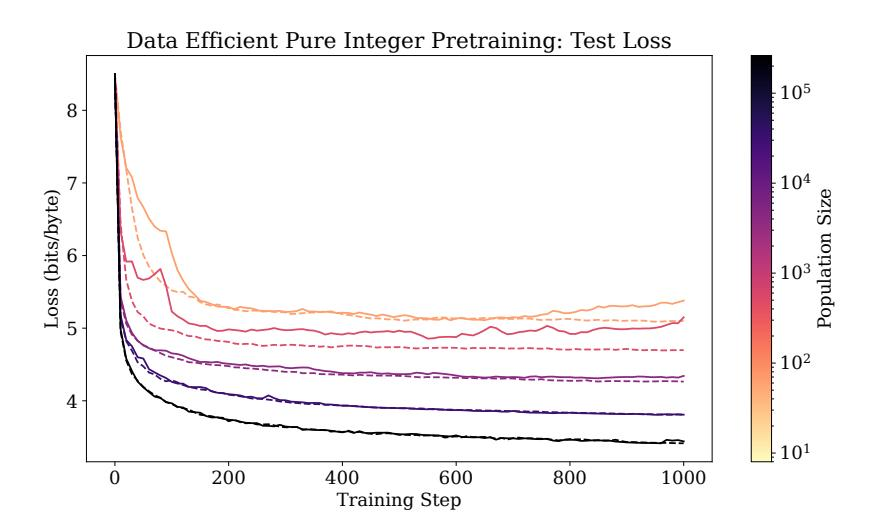

Figure 6: Test loss curves when reusing each sequence across 512 members of the population. Dashed lines indicate the original experiments where each antithetical pair receives a different sequence.

#### <span id="page-36-0"></span>**E.2** Controlling For Data Across Population Sizes

To determine whether the benefits of large population sizes are due to receiving more data or more unique perturbations, we run an experiment where smaller population sizes receive the same amount of data per step as the default for 32768. For instance, for a population size of 2, this means there is just one antithetical pair of perturbations but each is evaluated across 16384 data sequences. In principle, this means that each perturbation could have a cleaner fitness estimate. We plot results for population sizes of 2, 64, 512, 4096, and 32768 in Fig. 7.

<span id="page-36-2"></span>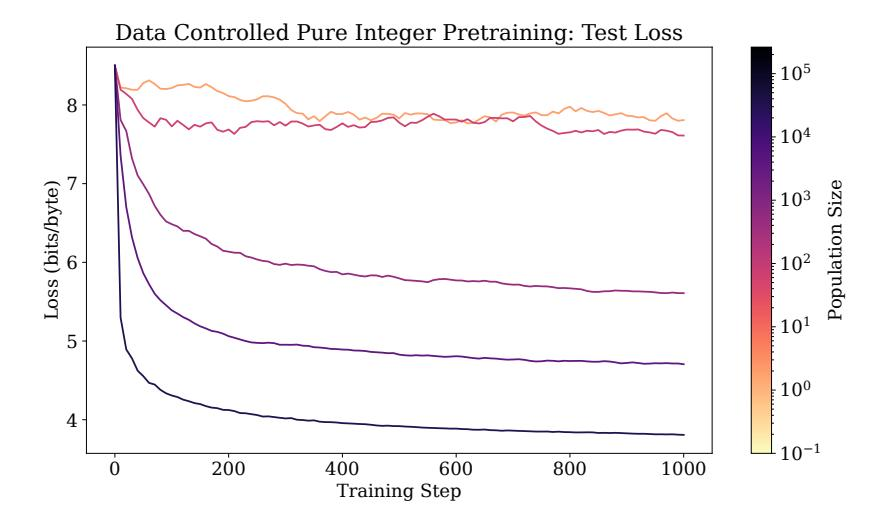

Figure 7: Test losses when different population sizes receive the same amount of data.

We find that maximizing the number of unique perturbations is critical for pretraining performance. Training is incredibly unstable at a population size of 2, which is analogous to zeroth order optimization, implying that pretraining would have been infeasible with prior zeroth order optimization approaches for LLM training or other ES works. In particular, Qiu et al. (2025) manages to get satisfactory speed with naïve ES in reasoning tasks by reusing the same perturbation hundreds of times and having a small population size, but Fig. 7 demonstrates that this strategy would not work for pretraining from scratch.

# <span id="page-37-0"></span>F EGGROLL Speed

<span id="page-37-3"></span>All timings were done on a single GPU on a GH200 (equivalent to a single H100) for a linear model with dimension 8192 in bfloat16, allowing a maximum batch size of 1024. For the graph in Fig. 2a, we pre-generate the noises instead of integrating the noise generation into the forward pass.

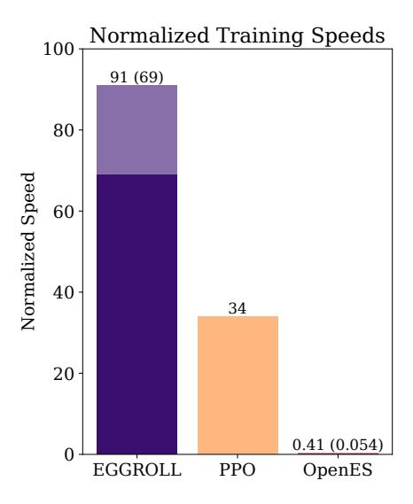

Figure 8: Relative speed of EGGROLL, when including jax noise regeneration.

In Fig. 8, we consider the impact of regenerating noises on-the-fly using jax PRNG. The darker area and value in parenthesis for EGGROLL and OpenES indicate the speed when regenerating noises on-the-fly, while the full bar indicates the speed when the noises are already generated.

We regenerate noises on the fly in our primary jax codebase, but pre-generating the EGGROLL perturbations beforehand is also a practical possibility since low-rank perturbations only require a small amount of memory, proportional to the square root of the size of the original parameter matrices.

# <span id="page-37-2"></span>**G** Experimental Details

# <span id="page-37-1"></span>**G.1** Reinforcement Learning Experiments

We present here the hyperparameter ranges we used for hyperparameter optimization, as well as all hyperparameter settings for all the experiments. All RL experiments were run on an NVIDIA L40S GPU. For PPO, we use the same methodology to tune the hyperparameters as we did for OpenES and EGGROLL as described in Section 6.2. We report the ranges and the final hyperparameters here. We train PPO agents using Rejax (Liesen et al., 2024).

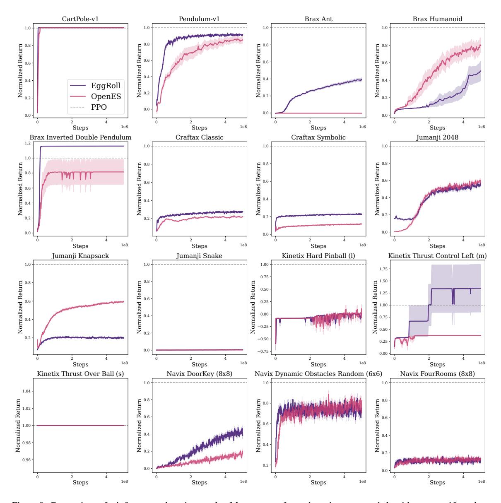

Figure 9: Comparison of reinforcement learning results: Mean returns for each environment and algorithm across 10 random seeds. The returns are evaluated using the mean of the parameters. HPO was conducted for each algorithm/environment pair. The shaded region is the standard error of the mean.

### <span id="page-38-0"></span>**G.2** Multi Agent Reinforcement Learning Experiments

We train on three cooperative Multi Particle Environments (MPEs) (Lowe et al., 2017) implemented in JaxMARL (Rutherford et al., 2023) with feed-forward networks of width 64 and depth 3, performing Bayesian hyperparameter optimization for each environment and algorithm. All runs were executed on NVIDIA A100-SXM4-40GB GPUs. We find that the optimal batch size is consistent across algorithms on the same environment. Figure 11 shows that EGGROLL with rank 1 trains up to 2.4 times faster than OpenES for large batch sizes while staying competitive in performance.

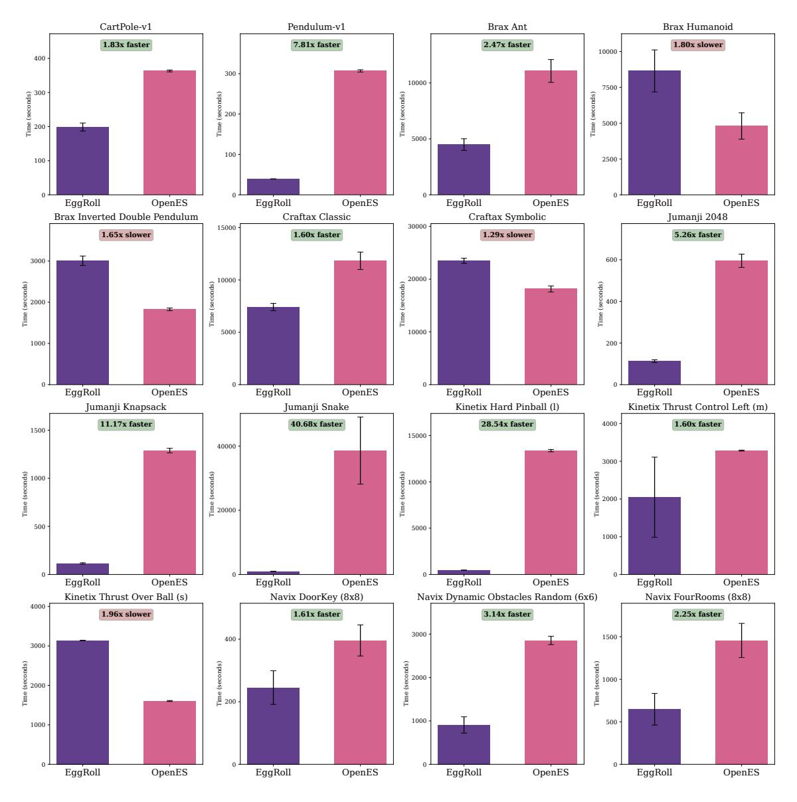

Figure 10: Comparison of reinforcement learning results: Mean and standard deviation of training time.

Table 1: Hyperparameter Ranges for EGGROLL and OpenES

| Hyperparameter         | Values                    |
|------------------------|---------------------------|
| pop_size               | 512, 1024, 2048, 4096     |
| n_parallel_evaluations | 1, 4, 8                   |
| rank                   | 1, 2, 4                   |
| optimizer              | adamw, sgd, adam          |
| learning_rate          | 1e-3, 1e-2, 1e-1          |
| lr_decay               | 0.995, 0.999, 0.9995, 1.0 |
| sigma                  | 0.05, 0.2, 0.5            |
| sigma_decay            | 0.995, 0.999, 0.9995, 1.0 |
| rank_transform         | true, false               |
| deterministic_policy   | true, false               |

Table 2: Hyperparameter Ranges for PPO

| Hyperparameter                | Values                   |
|-------------------------------|--------------------------|
| clip_eps                      | 0.1, 0.2, 0.3            |
| ent_coef                      | 0, 0.0001, 0.001         |
| gae_lambda                    | 0.9, 0.95, 0.98          |
| gamma                         | 0.95, 0.99, 0.995, 0.999 |
| learning_rate                 | 0.0001, 0.0003, 0.001    |
| max_grad_norm                 | 0.5, 1, 2                |
| layer_size                    | 256                      |
| n_layers                      | 3                        |
| normalize_observations        | true                     |
| normalize_rewards             | false                    |
| num_envs                      | 64, 128, 256             |
| num_epochs                    | 4, 8, 16                 |
| num_minibatches               | 16, 32, 64               |
| num_steps                     | 64, 128, 256             |
| reward_normalization_discount | 0.99                     |
| skip_initial_evaluation       | false                    |
| vf_coef                       | 0.5, 0.75, 1             |

Table 3: CartPole-v1

Table 4: Pendulum-v1

| Hyperparameter         | eggroll | open_es | Hyperparameter         | eggroll | open_es |
|------------------------|---------|---------|------------------------|---------|---------|
| activation             | pqn     | pqn     | activation             | pqn     | pqn     |
| deterministic_policy   | false   | true    | deterministic_policy   | false   | true    |
| learning_rate          | 0.1     | 0.1     | learning_rate          | 0.01    | 0.01    |
| lr_decay               | 0.9995  | 0.9995  | lr_decay               | 0.995   | 0.995   |
| layer_size             | 256     | 256     | layer_size             | 256     | 256     |
| n_layers               | 3       | 3       | n_layers               | 3       | 3       |
| n_parallel_evaluations | 1       | 4       | n_parallel_evaluations | 1       | 4       |
| pop_size               | 2048    | 512     | pop_size               | 4096    | 4096    |
| optimizer              | sgd     | adamw   | optimizer              | adam    | adamw   |
| rank                   | 4       | /       | rank                   | 4       | /       |
| rank_transform         | false   | true    | rank_transform         | false   | false   |
| sigma                  | 0.2     | 0.5     | sigma                  | 0.05    | 0.05    |
| sigma_decay            | 0.999   | 0.9995  | sigma_decay            | 0.995   | 1       |

### <span id="page-40-0"></span>G.3 Reasoning Fine-tuning Experiments: Countdown

We ran a Bayesian hyper-parameter sweep [\(Snoek et al.,](#page-15-15) [2012\)](#page-15-15) for both GRPO and EGGROLL and used the best set found to run the experiments in figure [5a.](#page-10-0) For GRPO we swept over sampling temperature and learning rate, whereas for EGGROLL we swept over the standard deviation of the ES sampling (*σ*) and the learning rate scale. The best hyper-parameters found are detailed on tables [26](#page-46-0) (EGGROLL) and [27](#page-46-1) (GRPO). All of the experiments run in 8 hours on a NVIDIA H200 GPU.

We also run an experiment where we increase the number of GPUs to 8 and use a bigger model, RWKV 7g7B, on the Countdown task, allowing for stronger final performance. Notably, we compare to the results reported by [Qiu et al.](#page-15-1) [\(2025\)](#page-15-1) on Countdown. Figure [12](#page-46-2) shows that starting from our significantly weaker model (RWKV 7g7B v.s. Qwen 2.5-7B), we are able to train to a higher validation accuracy (72.9%), v.s. the ones reported for training with GRPO (52.8%) and Open ES (66.8%). [Qiu et al.](#page-15-1) [\(2025\)](#page-15-1) do not report the wall clock time or the hardware used for their experiments which makes it difficult to establish a fair comparison.

Table 5: brax/ant

| Hyperparameter         | eggroll | open_es |
|------------------------|---------|---------|
| activation             | pqn     | pqn     |
| deterministic_policy   | false   | false   |
| learning_rate          | 0.01    | 0.1     |
| lr_decay               | 0.9995  | 0.995   |
| layer_size             | 256     | 256     |
| n_layers               | 3       | 3       |
| n_parallel_evaluations | 1       | 8       |
| pop_size               | 2048    | 512     |
| optimizer              | adam    | adam    |
| rank                   | 1       | /       |
| rank_transform         | false   | false   |
| sigma                  | 0.05    | 0.05    |
| sigma_decay            | 0.9995  | 0.9995  |

Table 7: brax/inverted\_double\_pendulum

| Hyperparameter         | eggroll | open_es |
|------------------------|---------|---------|
| activation             | pqn     | pqn     |
| deterministic_policy   | true    | true    |
| learning_rate          | 0.1     | 0.1     |
| lr_decay               | 1       | 0.995   |
| layer_size             | 256     | 256     |
| n_layers               | 3       | 3       |
| n_parallel_evaluations | 1       | 1       |
| pop_size               | 2048    | 4096    |
| optimizer              | adam    | adam    |
| rank                   | 2       | /       |
| rank_transform         | true    | true    |
| sigma                  | 0.5     | 0.05    |
| sigma_decay            | 0.995   | 1       |

Table 9: craftax/Craftax-Symbolic-AutoReset-v1

<span id="page-41-0"></span>

| Hyperparameter         | eggroll | open_es |
|------------------------|---------|---------|
| activation             | pqn     | pqn     |
| deterministic_policy   | false   | false   |
| learning_rate          | 0.01    | 0.1     |
| lr_decay               | 0.999   | 0.995   |
| layer_size             | 256     | 256     |
| n_layers               | 3       | 3       |
| n_parallel_evaluations | 1       | 4       |
| pop_size               | 512     | 1024    |
| optimizer              | sgd     | adam    |
| rank                   | 4       | /       |
| rank_transform         | true    | false   |
| sigma                  | 0.05    | 0.5     |
| sigma_decay            | 0.999   | 1       |

Table 6: brax/humanoid

| Hyperparameter         | eggroll | open_es |
|------------------------|---------|---------|
| activation             | pqn     | pqn     |
| deterministic_policy   | true    | false   |
| learning_rate          | 0.1     | 0.1     |
| lr_decay               | 1       | 0.995   |
| layer_size             | 256     | 256     |
| n_layers               | 3       | 3       |
| n_parallel_evaluations | 8       | 8       |
| pop_size               | 4096    | 1024    |
| optimizer              | adam    | sgd     |
| rank                   | 1       | /       |
| rank_transform         | true    | true    |
| sigma                  | 0.2     | 0.2     |
| sigma_decay            | 0.9995  | 0.995   |

Table 8: craftax/Craftax-Classic-Symbolic-AutoReset-v1

| Hyperparameter         | eggroll | open_es |
|------------------------|---------|---------|
| activation             | pqn     | pqn     |
| deterministic_policy   | false   | false   |
| learning_rate          | 0.01    | 0.001   |
| lr_decay               | 0.995   | 0.995   |
| layer_size             | 256     | 256     |
| n_layers               | 3       | 3       |
| n_parallel_evaluations | 4       | 8       |
| pop_size               | 2048    | 4096    |
| optimizer              | sgd     | adamw   |
| rank                   | 1       | /       |
| rank_transform         | false   | false   |
| sigma                  | 0.05    | 0.05    |
| sigma_decay            | 1       | 0.995   |

Table 10: jumanji/Game2048-v1

| Hyperparameter         | eggroll | open_es |
|------------------------|---------|---------|
| activation             | pqn     | pqn     |
| deterministic_policy   | false   | true    |
| learning_rate          | 0.1     | 0.01    |
| lr_decay               | 1       | 0.999   |
| layer_size             | 256     | 256     |
| n_layers               | 3       | 3       |
| n_parallel_evaluations | 4       | 4       |
| pop_size               | 1024    | 1024    |
| optimizer              | adamw   | adamw   |
| rank                   | 1       | /       |
| rank_transform         | false   | true    |
| sigma                  | 0.5     | 0.05    |
| sigma_decay            | 0.9995  | 0.9995  |

Table 11: jumanji/Knapsack-v1

| Hyperparameter         | eggroll | open_es |
|------------------------|---------|---------|
| activation             | pqn     | pqn     |
| deterministic_policy   | false   | false   |
| learning_rate          | 0.1     | 0.01    |
| lr_decay               | 0.999   | 1       |
| layer_size             | 256     | 256     |
| n_layers               | 3       | 3       |
| n_parallel_evaluations | 4       | 1       |
| pop_size               | 1024    | 2048    |
| optimizer              | sgd     | adamw   |
| rank                   | 4       | /       |
| rank_transform         | true    | true    |
| sigma                  | 0.05    | 0.5     |
| sigma_decay            | 1       | 0.995   |

Table 13: kinetix/l/hard\_pinball

| Hyperparameter         | eggroll | open_es |
|------------------------|---------|---------|
| activation             | pqn     | pqn     |
| deterministic_policy   | true    | true    |
| learning_rate          | 0.01    | 0.01    |
| lr_decay               | 0.995   | 1       |
| layer_size             | 256     | 256     |
| n_layers               | 3       | 3       |
| n_parallel_evaluations | 8       | 1       |
| pop_size               | 2048    | 512     |
| optimizer              | sgd     | sgd     |
| rank                   | 4       | /       |
| rank_transform         | true    | true    |
| sigma                  | 0.05    | 0.5     |
| sigma_decay            | 0.999   | 0.9995  |

Table 15: kinetix/s/h1\_thrust\_over\_ball

| Hyperparameter         | eggroll | open_es |
|------------------------|---------|---------|
| activation             | pqn     | pqn     |
| deterministic_policy   | false   | false   |
| learning_rate          | 0.1     | 0.01    |
| lr_decay               | 0.995   | 0.995   |
| layer_size             | 256     | 256     |
| n_layers               | 3       | 3       |
| n_parallel_evaluations | 1       | 1       |
| pop_size               | 512     | 2048    |
| optimizer              | adamw   | sgd     |
| rank                   | 1       | /       |
| rank_transform         | true    | true    |
| sigma                  | 0.5     | 0.05    |
| sigma_decay            | 0.9995  | 1       |

Table 12: jumanji/Snake-v1

| Hyperparameter         | eggroll | open_es |
|------------------------|---------|---------|
| activation             | pqn     | pqn     |
| deterministic_policy   | false   | false   |
| learning_rate          | 0.001   | 0.001   |
| lr_decay               | 0.9995  | 1       |
| layer_size             | 256     | 256     |
| n_layers               | 3       | 3       |
| n_parallel_evaluations | 8       | 1       |
| pop_size               | 4096    | 2048    |
| optimizer              | adam    | sgd     |
| rank                   | 1       | /       |
| rank_transform         | true    | false   |
| sigma                  | 0.05    | 0.2     |
| sigma_decay            | 0.9995  | 1       |

Table 14: kinetix/m/h17\_thrustcontrol\_left

| Hyperparameter         | eggroll | open_es |
|------------------------|---------|---------|
| activation             | pqn     | pqn     |
| deterministic_policy   | false   | false   |
| learning_rate          | 0.1     | 0.001   |
| lr_decay               | 0.9995  | 1       |
| layer_size             | 256     | 256     |
| n_layers               | 3       | 3       |
| n_parallel_evaluations | 4       | 1       |
| pop_size               | 512     | 1024    |
| optimizer              | sgd     | adam    |
| rank                   | 4       | /       |
| rank_transform         | true    | true    |
| sigma                  | 0.5     | 0.5     |
| sigma_decay            | 1       | 0.999   |

Table 16: navix/Navix-DoorKey-8x8-v0

| Hyperparameter         | eggroll | open_es |
|------------------------|---------|---------|
| activation             | pqn     | pqn     |
| deterministic_policy   | false   | false   |
| learning_rate          | 0.01    | 0.01    |
| lr_decay               | 0.9995  | 1       |
| layer_size             | 256     | 256     |
| n_layers               | 3       | 3       |
| n_parallel_evaluations | 1       | 8       |
| pop_size               | 1024    | 2048    |
| optimizer              | adamw   | adam    |
| rank                   | 1       | /       |
| rank_transform         | false   | true    |
| sigma                  | 0.05    | 0.05    |
| sigma_decay            | 1       | 1       |

#### G.4 Reasoning Fine-tuning Experiments: GSM8K

We used the hyper-parameters found for Countdown as a starting point and reduced the learning rates for both GRPO and EGGROLL using linear search until we found the best performing one on the validation set.

Table 17: navix/Navix-Dynamic-Obstacles-6x6-Randomv0

Hyperparameter eggroll open\_es activation pqn pqn deterministic\_policy false false learning\_rate 0.01 0.01 lr\_decay 0.999 1 layer\_size 256 256 n\_layers 3 3 n\_parallel\_evaluations 4 1 pop\_size 512 4096 optimizer adam adam rank 2 / rank\_transform false false

sigma 0.05 0.2 sigma\_decay 1 0.995

Table 18: navix/Navix-FourRooms-v0

| Hyperparameter         | eggroll | open_es |
|------------------------|---------|---------|
|                        |         |         |
| activation             | pqn     | pqn     |
| deterministic_policy   | false   | false   |
| learning_rate          | 0.01    | 0.001   |
| lr_decay               | 0.999   | 0.9995  |
| layer_size             | 256     | 256     |
| n_layers               | 3       | 3       |
| n_parallel_evaluations | 4       | 4       |
| pop_size               | 2048    | 2048    |
| optimizer              | sgd     | adam    |
| rank                   | 4       | /       |
| rank_transform         | true    | false   |
| sigma                  | 0.05    | 0.05    |
| sigma_decay            | 0.9995  | 0.9995  |

Table 19: PPO Hyperparameters (Set 1)

| Hyperparameter    | CartPole | Pendulum | Ant    | Humanoid | IDP    | CraftaxClassic | CraftaxSymbolic | Game2048 |
|-------------------|----------|----------|--------|----------|--------|----------------|-----------------|----------|
| activation        | pqn      | pqn      | pqn    | pqn      | pqn    | pqn            | pqn             | pqn      |
| clip_eps          | 0.2      | 0.1      | 0.2    | 0.3      | 0.1    | 0.2            | 0.2             | 0.3      |
| ent_coef          | 0.0001   | 0.001    | 0      | 0.0001   | 0.0001 | 0.0001         | 0               | 0.001    |
| gae_lambda        | 0.9      | 0.95     | 0.95   | 0.9      | 0.98   | 0.98           | 0.9             | 0.9      |
| gamma             | 0.995    | 0.999    | 0.995  | 0.95     | 0.99   | 0.95           | 0.95            | 0.99     |
| learning_rate     | 0.0003   | 0.0003   | 0.0003 | 0.0001   | 0.001  | 0.001          | 0.0003          | 0.0003   |
| max_grad_norm     | 0.5      | 1        | 0.5    | 2        | 2      | 2              | 2               | 2        |
| layer_size        | 256      | 256      | 256    | 256      | 256    | 256            | 256             | 256      |
| n_layers          | 3        | 3        | 3      | 3        | 3      | 3              | 3               | 3        |
| normalize_obs     | true     | true     | true   | true     | true   | true           | true            | true     |
| normalize_rew     | false    | false    | false  | false    | false  | false          | false           | false    |
| num_envs          | 256      | 256      | 64     | 256      | 64     | 128            | 256             | 64       |
| num_epochs        | 4        | 16       | 8      | 4        | 4      | 4              | 4               | 8        |
| num_minibatches   | 32       | 16       | 32     | 64       | 64     | 32             | 32              | 16       |
| num_steps         | 128      | 256      | 128    | 64       | 128    | 128            | 64              | 64       |
| rew_norm_discount | 0.99     | 0.99     | 0.99   | 0.99     | 0.99   | 0.99           | 0.99            | 0.99     |
| skip_initial_eval | false    | false    | false  | false    | false  | false          | false           | false    |
| vf_coef           | 0.5      | 1        | 1      | 0.75     | 1      | 0.5            | 0.75            | 0.75     |

Our experiments for GSM8K run on 8 NVIDIA H200 GPUS for 8 hours each. We also increase the standard deviation, *σ*, parameter for ES (from 7 × 10<sup>−</sup><sup>4</sup> to 2 × 10<sup>−</sup><sup>3</sup> ) as the significantly bigger population sizes (8096 v.s. 512) allow for much more stable training and aggressive exploration.

Table 20: PPO Hyperparameters (Set 2)

| Hyperparameter    | Knapsack | Snake  | HardPinball | ThrustLeft | ThrustBall | DoorKey | DynamicObs | FourRooms |
|-------------------|----------|--------|-------------|------------|------------|---------|------------|-----------|
| activation        | pqn      | pqn    | pqn         | pqn        | pqn        | pqn     | pqn        | pqn       |
| clip_eps          | 0.1      | 0.3    | 0.1         | 0.2        | 0.2        | 0.1     | 0.1        | 0.1       |
| ent_coef          | 0.0001   | 0.001  | 0.0001      | 0.0001     | 0.0001     | 0.0001  | 0.001      | 0.001     |
| gae_lambda        | 0.9      | 0.95   | 0.9         | 0.9        | 0.95       | 0.98    | 0.98       | 0.9       |
| gamma             | 0.99     | 0.999  | 0.99        | 0.995      | 0.999      | 0.95    | 0.999      | 0.99      |
| learning_rate     | 0.0001   | 0.0001 | 0.0001      | 0.0001     | 0.0001     | 0.0003  | 0.001      | 0.001     |
| max_grad_norm     | 0.5      | 0.5    | 1           | 2          | 0.5        | 0.5     | 1          | 1         |
| layer_size        | 256      | 256    | 256         | 256        | 256        | 256     | 256        | 256       |
| n_layers          | 3        | 3      | 3           | 3          | 3          | 3       | 3          | 3         |
| normalize_obs     | true     | true   | true        | true       | true       | true    | true       | true      |
| normalize_rew     | false    | false  | false       | false      | false      | false   | false      | false     |
| num_envs          | 256      | 128    | 256         | 256        | 64         | 64      | 128        | 256       |
| num_epochs        | 4        | 4      | 16          | 16         | 16         | 16      | 4          | 8         |
| num_minibatches   | 64       | 16     | 16          | 32         | 16         | 64      | 16         | 32        |
| num_steps         | 128      | 128    | 64          | 128        | 64         | 256     | 128        | 256       |
| rew_norm_discount | 0.99     | 0.99   | 0.99        | 0.99       | 0.99       | 0.99    | 0.99       | 0.99      |
| skip_initial_eval | false    | false  | false       | false      | false      | false   | false      | false     |
| vf_coef           | 0.75     | 0.75   | 0.5         | 0.5        | 0.5        | 0.75    | 0.5        | 0.75      |

<span id="page-44-0"></span>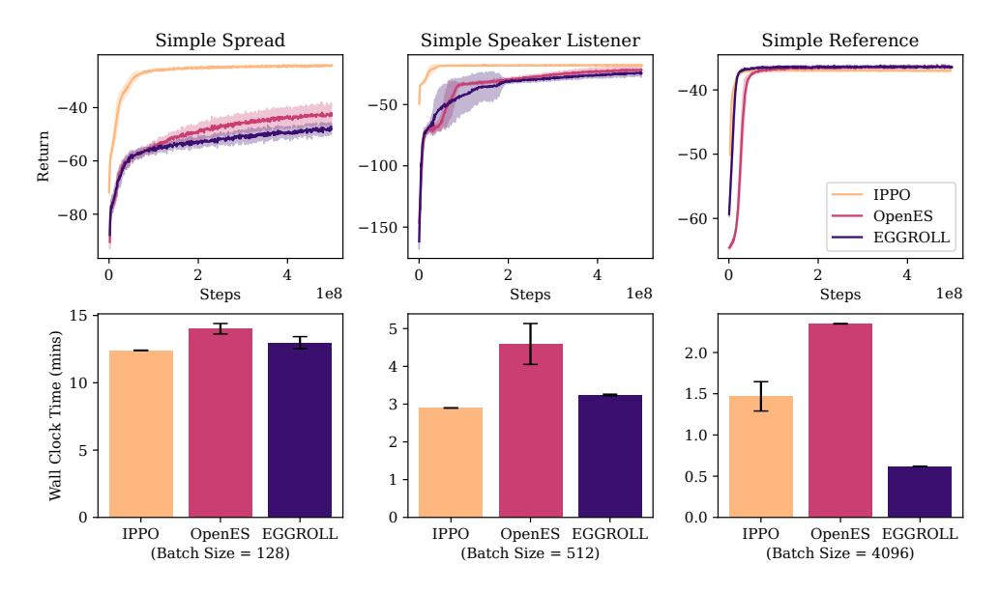

Figure 11: Training curves and wall clock times for cooperative Multi Particle Environments. Hyperparameter optimization yielded equal batch sizes for all algorithms on the same environment. All EGGROLL runs used rank 1 perturbations. Shaded regions are standard errors of mean values.

Table 21: Hyperparameter Ranges Used in MPE Sweeps for EGGROLL and OpenES

| Hyperparameter | Values                     |
|----------------|----------------------------|
| activation     | pqn, tanh                  |
| pop_size       | 128, 512, 1024, 2048, 4096 |
| learning_rate  | 0.01, 0.05, 0.1, 0.5       |
| lr_decay       | 0.3, 0.7, 1.0              |
| sigma          | 0.1, 0.2, 0.3, 0.4, 0.5    |
| rank_transform | true, false                |

Table 22: Hyperparameter Ranges Used in MPE Sweeps for IPPO

| Hyperparameter | Values                     |
|----------------|----------------------------|
| activation     | relu, tanh                 |
| pop_size       | 128, 512, 1024, 2048, 4096 |
| learning_rate  | 5e-5, 1e-4, 2.5e-4, 1e-3   |
| entropy_coef   | 0.001, 0.005, 0.01         |

Table 23: MPE Simple Spread v3

Table 24: MPE Simple Speaker Listener v4

| Hyperparameter       | eggroll | open_es | ippo   | Hyperparameter       | eggroll | open_es | ippo   |
|----------------------|---------|---------|--------|----------------------|---------|---------|--------|
| activation           | tanh    | tanh    | tanh   | activation           | tanh    | tanh    | relu   |
| deterministic_policy | true    | true    | false  | deterministic_policy | true    | true    | false  |
| learning_rate        | 0.01    | 0.01    | 0.001  | learning_rate        | 0.01    | 0.01    | 0.001  |
| lr_decay             | 0.7     | 0.7     | linear | lr_decay             | 0.7     | 0.3     | linear |
| layer_size           | 64      | 64      | 64     | layer_size           | 64      | 64      | 64     |
| n_layers             | 3       | 3       | 3      | n_layers             | 3       | 3       | 64     |
| pop_size             | 128     | 128     | 128    | pop_size             | 512     | 512     | 512    |
| optimizer            | adamw   | adamw   | adam   | optimizer            | adamw   | adamw   | adam   |
| rank                 | 1       | 1       | -      | rank                 | 1       | 1       | -      |
| rank_transform       | false   | false   | -      | rank_transform       | true    | true    | -      |
| sigma                | 0.5     | 0.5     | -      | sigma                | 0.5     | 0.5     | -      |
| n_minibatches        | -       | -       | 4      | n_minibatches        | -       | -       | 4      |
| update_epochs        | -       | -       | 4      | update_epochs        | -       | -       | 4      |
| gamma                | -       | -       | 0.99   | gamma                | -       | -       | 0.99   |
| gae_lambda           | -       | -       | 0.95   | gae_lambda           | -       | -       | 0.95   |
| epsilon_clip         | -       | -       | 0.2    | epsilon_clip         | -       | -       | 0.2    |
| entropy_coef         | -       | -       | 0.01   | entropy_coef         | -       | -       | 0.005  |
| value_coef           | -       | -       | 0.5    | value_coef           | -       | -       | 0.5    |
| max_grad_norm        | -       | -       | 0.5    | max_grad_norm        | -       | -       | 0.5    |

Table 25: MPE Simple Reference v3

| Hyperparameter       | eggroll | open_es | ippo   |
|----------------------|---------|---------|--------|
| activation           | pqn     | tanh    | relu   |
| deterministic_policy | true    | true    | false  |
| learning_rate        | 0.01    | 0.01    | 0.001  |
| lr_decay             | 0.3     | 0.3     | linear |
| layer_size           | 64      | 64      | 64     |
| n_layers             | 3       | 3       | 3      |
| pop_size             | 4096    | 4096    | 4096   |
| optimizer            | adamw   | adamw   | adam   |
| rank                 | 1       | 1       | -      |
| rank_transform       | false   | true    | -      |
| sigma                | 0.1     | 0.3     | -      |
| n_minibatches        | -       | -       | 4      |
| update_epochs        | -       | -       | 4      |
| gamma                | -       | -       | 0.99   |
| gae_lambda           | -       | -       | 0.95   |
| epsilon_clip         | -       | -       | 0.2    |
| entropy_coef         | -       | -       | 0.01   |
| value_coef           | -       | -       | 0.5    |
| max_grad_norm        | -       | -       | 0.5    |

<span id="page-46-0"></span>

| Hyperparameter                            | Value              |
|-------------------------------------------|--------------------|
| Model                                     | RWKV 7g1.5B        |
| Optimizer                                 | Gradient descent   |
| ES standard deviation $\sigma$            | $7 \times 10^{-4}$ |
| Rank $r$                                  | 1                  |
| Learning-rate scale $\eta_{\text{scale}}$ | 0.125              |
| Population size                           | 256                |
| Parallel generations per GPU              | 1536               |
| Prompts per epoch                         | 6                  |
| Generation / thinking length              | 1000 tokens        |
| Train / val temperature                   | 0/0                |
| Parallel validations                      | 128                |

<span id="page-46-1"></span>Table 26: Key hyperparameters for EGGROLL training on Countdown with FastRWKV-7g1.5B.

| Hyperparameter                           | Value              |
|------------------------------------------|--------------------|
| Model                                    | RWKV 7g1.5B        |
| Optimizer                                | Radam              |
| Learning rate $\eta$                     | $3 \times 10^{-6}$ |
| Generations per prompt $G$               | 8                  |
| Parallel generations per GPU             | 64                 |
| Prompts per epoch                        | 8                  |
| Generation length                        | 1000 tokens        |
| Number of minibatches                    | 4                  |
| PPO clip parameter $\epsilon_{\rm clip}$ | 0.2                |
| Train / val temperature                  | 1/0                |
| Parallel validations                     | 128                |

Table 27: Key hyperparameters for GRPO training on Countdown with AssociativeScanRWKV-7g1.5B.

<span id="page-46-2"></span>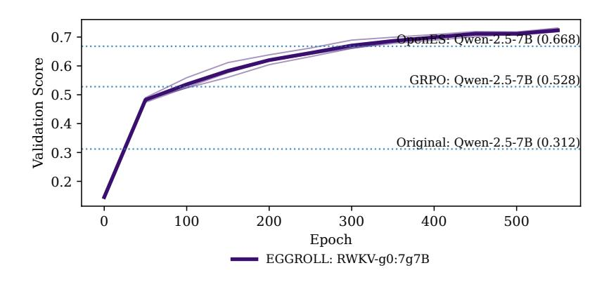

Figure 12: Validation score training curve of an RWKV 7g7B model on countdown using 8 GPUS and a population size of 8096. Notably, we are able to outperform a stronger base model trained with GRPO and OpenES.

| Hyperparameter               | Value       |
|------------------------------|-------------|
| Model                        | RWKV 7g7B   |
| ES standard deviation σ      | 2 × 10−3    |
| Rank r                       | 1           |
| Learning-rate scale ηscale   | 0.06        |
| Generations per prompt G     | 512         |
| Parallel generations per GPU | 1024        |
| Total parallel generations   | 8192        |
| Prompts per epoch            | 16          |
| Generation length            | 1000 tokens |
| Noise reuse factor           | 1           |
| Freeze non-LoRA params       | True        |
| Train / val temperature      | 0 / 0       |
| Parallel validations         | 128         |

Table 28: Key hyperparameters for multi-GPU EGGROLL training on GSM8K with FastRWKV-7g7B.

| Hyperparameter                | Value       |
|-------------------------------|-------------|
| Model                         | RWKV 7g7B   |
| Learning rate η               | 1 × 10−6    |
| Generations per prompt G      | 8           |
| Parallel generations per GPU  | 32          |
| Total parallel generations    | 256         |
| Prompts per epoch             | 32          |
| Generation length             | 1000 tokens |
| Number of minibatches         | 16          |
| Number of workers (processes) | 8           |
| PPO clip parameter ϵclip      | 0.2         |
| Train / val temperature       | 1 / 0       |
| Parallel validations          | 128         |

Table 29: Key hyperparameters for multi-GPU GRPO training on GSM8K with AssociativeScanRWKV-7g7B.